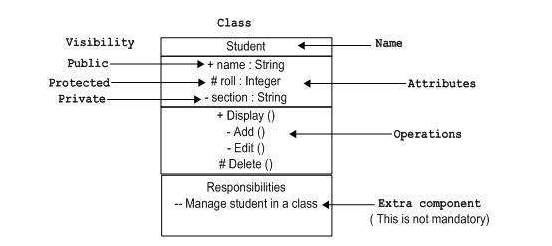

__Array__

An array is a container object that holds a fixed number of values of a single type. The length of an array is established when the array is created. After creation, its length is __fixed__.

Array is an object


```java
// declares an array of integers
int[] anArray;   // type[] name

// allocates memory for 10 integers
anArray = new int[10];

// short hand assignment
String[] reindeer = {"dasher", "prancer", "comet", "cupid"};
```


__ArrayList__

Resizable-array implementation of the List interface.


__Collection__

The root interface in the collection hierarchy. A collection represents a group of objects, known as its elements. Some collections allow duplicate elements and others do not. Some are ordered and others unordered. The JDK does not provide any direct implementations of this interface: it provides implementations of more specific subinterfaces like `Set` and `List`. This interface is typically used to pass collections around and manipulate them where maximum generality is desired.


__Unified Modelling language__


1. Things  
Defines static part of the model.  
+ class: sets of object with similar responsibility
  + attributes  
  + operations
+ interface: set of operations which specify responsibility of class  
+ collaboration: interaction between elements

2. Relationships  
3. Diagrams

_Notation_

  


__Class-responsibility-collaboration (CRC) Cards__

1. On top of the card, the _class name_  
2. On the left, the responsibilities of the class  
3. On the right, collaborators (other classes) with which this class interacts to fulfill its responsibilities  


```java
package week6;
public abstract class Grade<T> implements Comparable<Grade> {

	public static final String[] VALID_GRADES = { "A", "B", "C", "D", "F" };

	public abstract double gpa();

	public static String toLetter(int grade) {
		if (grade < 50) {
			return "F";
		}
		if (grade < 60) {
			return "D";
		}
		if (grade < 70) {
			return "C";
		}
		if (grade < 80) {
			return "B";
		}
		return "A";
	}

  @Override
  public int compareTo(Grade other) {
      return (new Double(this.gpa()).compareTo(new Double(other.gpa())));
  }


}
```
