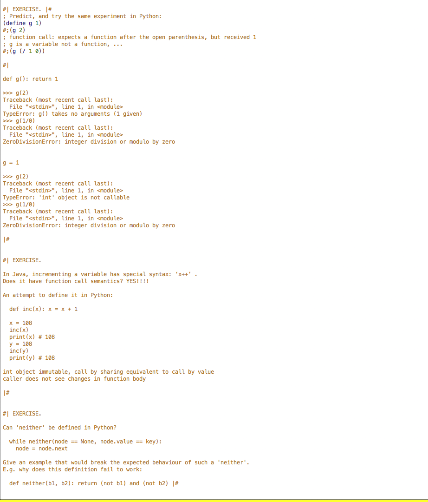

+ _evaluation strategy_ 
    + determines _when_ to evaluate the arguments of a function call and _what_ kind of values are pass to the function 
    + _by value/by reference_ 
        + function evaluates arguments before proceeds to evaluation of body 
        + 2 _capabilities_ 
            + look up current value 
            + modify value of argument with assignment 
+ _eager (strict) evaluation_
    + an expression is evaluated as soon as it is bound to a variable 
        + i.e. arguments to a function always evaluated completely before the function is applied 
    + _advantage_ 
        + deliminates the need to track and schedule the evaluation of expressions 
        + programmer dictates order of execution 
    + _disadvantage_ 
        + forces evaluation of expressions that may not be necessary at runtime
        + delay evaluation of expressions that have a more immediate need
        + compiler optimization for lazy evaluation often eliminate unnecessary expression from executing entirely 
    + _categories_ 
        + _call by value_ 
            + argument evaluated and resulting value bound to variable in function
            + anything passed to function call is unchanged in caller's scope when function returns 
        + _call by reference_ 
            + a function receives an implicit reference to a variable used as argument, rather than a copy of its value
            + implies function can modify the variable, changes are seen by its caller
            + _strategies_    
                + _simulation with by-value references (ie.e. pointers)_ 
                    + C
                + _call by sharing_ 
                    + passing an object which can then be mutated
                    + Java, Python, Ruby
            + _purely functional languages_ 
                + 2 strategies are equivalent since data structures are immutable
        + _call by sharing_ 
            + implies values in languages are based on objects rather than primitive types (all values are boxed!)
            + _semantics_ 
                + assignments to function arguments within function aren't visible to the caller (unlike _by-reference semantics_)
                + _not call by value_ 
                    + since mutations of arguments are performed by the called routine will be visible to the caller 
                + _not call by reference_ 
                    + since access is not given to the variables of the caller, but merely to certain objects
                + _summarizing example_
                    + say a variable is passed, cannot simulate assignment on that variable in caller's scope (not by reference)
                    + but since function has access to the same object as the caller (no copy made), mutations to those objects, if objects are mutable, within the function are visible to the caller (not by value)
            ```py 
            def f(l):
                l.append(1)
            m = []
            f(m)
            print(m)        // [1]
            ```
            + function can modify lists, which is mutable in python 
            ```py
            def f(l):
                l = [1]
            m = []
            print(m)        // []
            ```
            + assignment are not noticeable to the caller 
                + since assignment binds a varaible to a different object rather than mutating the object 
                    + `l = [1]` reassigns a new list to the variable rather than to the location is references 
                + and rebound variable exists within the scope of the function only
            + _observation_ 
                + _immutable objects_: no difference between _call by sharing_ and _call by value_
+ _lazy evaluation_ 
    + expressions are evaluated only when a dependent expression is evaluated


```
(define (<function-name> <parameter-name> ...)
     <result-expression>)
```


+ _note_ 
    + _short-circuiting_
        + does not follow function call semantics
    + _initialization_
        + does not evaluate the variable 
        + does not follow function call semantics
    + _`operator+()`_
        + follows function calls semantics

