# Chapter 1

+ _OS_ 
    + simply a software that runs in kernel mode 
        + _OS as extended machine_ 
            + provide user application a clean abstraction set of resources to use 
            + 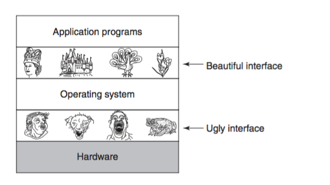
            +_disk driver_ 
                + deals with hardware and provides interface to read/write disk blocks 
                + the OS uses `file` as an additional level of abstraction over file I/O
            + OS should create good abstractions and then implement and manage abstract objects thus created
        + _OS as resource manager_
            + orderly and controlled allocation of 
                + hardware: processors, memories, IO devices 
                + information: files, databases
            + _multiplexing_ resources in
                + time 
                    + decide who goes next and for how long
                    + i.e. CPU usage cross multiple programs
                + space "
                    + each gets part of the resource 
                    + i.e. memory is divided among several running program, disk holds file for many users at same time
    + _moder of operation_  
        + 
        + _kernel (supervisor) mode_ 
            + OS runs in this mode
            + access to all hardware, able to execute any instruction machine is capable of executing 
        + _user mode_ 
            + only a subset of machine instruction avaialble 
                + control machine or do I/O is forbidden
    + _architecture_    
        + characterized by instruction set, memory organization, IO, bus structure 
+ _history_ 
    + _first gen_ 
        + _vacuum tubes_ 
    + _second gen_ 
        + _mainframes_ (transistors) 
            + write program (FORTRAN) on paper
            + punch on card 
            + input to computer 
        + _batch system_ 
            + 
            + collect a tray of puch cards and read onto magnetic tape and printing output 
    + _third gen_ _Integrated circuit_  
            + IBM360 
                + _multiprogramming_  
                + 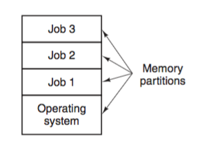   
                    + commercial data processing majority of time is I/O wait time, CPU idles  
                    + solution invovles partition memory into several pieces, with differnet job at each partition.
                    + so if one job is waiting for IO, another job keeps CPU busy
                + _spooling_ (simultaneous peripheral operation on line)
                    + whenever a running jo finish, OS lead a new job from disk into non-empty paritition
                + hope to create OS such that program runs in both computing/commercial tasks 
                    + as a result, made OS extraordinarily complex
                + _timsharing_  
                    + batch job takes too long, missplaced comma would mean job fail 
                    + several user log onto computer for interactive services
            + _ken thompson_ and _UNIX_, `ed`, B language and golang
            + _UNIX_ 
                + System V and BSD are variants of UNIX
                + POSIX is a standard for UNIX
                + Linux, free producton version of UNIX
    + _fourth gen_ personal computer 
        + mid 1980, IBM PC looking for OS, Gates happen to find one DOS (disk operating system), created MS-DOS OS for IBM PC
        + Jobs made first macintosh with GUI, success
            + 1999, Apple adopted a kernel originally developed to replace kernel of BSD UNIX, hence mac OS X is UNIX based OS
        + Microsoft made Windows which is a GUI runninng on top of MS-DOS
            + Windows NT is a OS rewritten
        + _x86_ is all modern processors based on family of instruction set architecture started with 8086 in 1970s
        + _X window system_ X11
            + handles basic window management
    + _fiffth gen_ 
        + mobile computers 
+ _hardware review_ 
    + _processor_   
        + _CPU_     
            + fetch instruction from memory and execute them
            + instruction set are different cross different CPU architectures (x86 vs. ARM)
            + _program counter_ 
                + contains memory addr of next instruction to be fetched 
            + _stack pointer_ 
                + one frame for each procedure, 
                + holds input param, local var, temp variable 
            + _PSW_ program status word 
                + condition code bits, 
                + a bit in PSW controls user/kernel mode
            + _register_ 
                + context switching requires save all registers so be later restored when program runs later
            + _pipeline_ 
                + 
                + more than one instrucion can be run at the same time 
                    + separate fetch, decode, and execute units 
            + most CPU has two modes, 
                + _kernel_: CPU can execute every instruction set and use every feature of hardware 
                + _user_: 
                    + instruction involving IO and memory protection are disallowed in user mode 
                    + _syscall_ used to obtain resources, which traps into kernel and invokes the OS
                        + `TRAP` instruction switches from user to kernel mode
            + _trap_ 
                + may be caused by hardware to warn of exceptional situation
    + _multithreaded and multicore chips_ 
        + 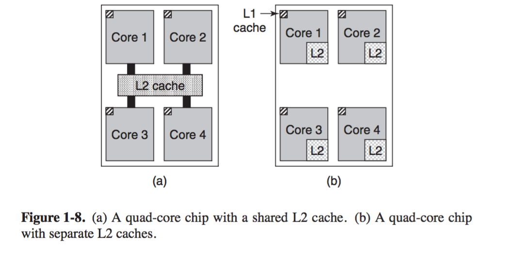
        + multithreaded: fast switching between threads 
        + multicore: multi-processor
        + GPU: thousands of tiny cores, good for small computation done in parallel
    + _memory_ 
        + speed, size, cost are tradeoffs
        + 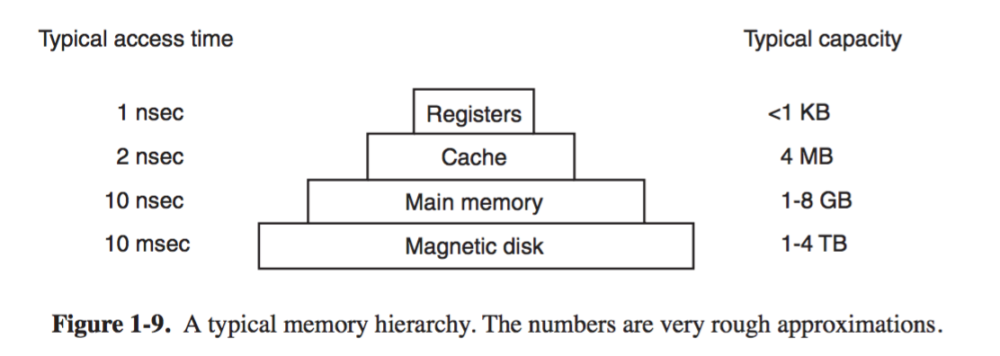
            + _register_: same material as CPU, typically 32x32
            + _cache_
                + _cache line_: each 64 bytes, 
                    + closer to CPU, faster it gets. 
                + _cache hit_: when the memory word requested is in the cache line 
                    + 2 clock cycles 
                + _cache miss_: memory request has to go to memory, with time penalty
                + used to improve performance of resources which are used heavily 
                    + i.e. keep heavily used files in memory instead of fetching from disk repeatedly. 
                + modern CPU has two cache 
                    + _L1 cache_: inside CPU, usually feeds decoded instructions into CPU execution engine  
                    + _L2 cache_: several megabytes of recently used memory words
                        + delay of 1~2 clock cycles
            + _main memory_ 
                + called _RAM_ (random access memory)
                    + small amount of _non-volatile RAM_ (ROM), which is persistent upon power lose 
                        + _bootstrap loader_ used to start computer is contained in ROM (some computers)
                    + _flash memory_: non-volatile, but can be erased/rewritten. Writing takes orders of magnitude mroe than writing RAM
                    
            + _disks_ 
                + 
                + 3 orders of magnitude slower since its a mechanical device
                + _solid state disk_    
                    + really are _flash memory_  
                + _virtual memory_ 
                    + able to run programs requiring larger than physical memory by placing them on disk and use main memory as a kind of cache for most heavily executed part
                    + _MMU (memory management unit)_: part of CPU that converts memory addres program generated to address in RAM where word is located.
    + _IO devices_ 
        + consists of a controller and the device itself. 
        + _device driver_ 
            + the software that talks to a controller, giving it commands and accepting responses
            + usually runs in kernel mode 
            + 3 ways to load driver 
                + relink kernel with new driver and reboot 
                + make entry in OS file telling it needs the driver and reboot, at boot time OS goes and finds driver and loads them (Windows)
                + accept new drivers while running and installing them no the fly without need to reboot 
                    + i.e. hot-pluggable devices like USB
        + _Input and Output_ 
            + 3 ways 
                + _busy waiting_: 
                    + user program issues syscall, which kernel translates to procedure call to appropriate driver which starts I/O and polls the device to see if its done, and put data to appropriate place when finishes. The OS returns control to caller. 
                    + disadvantage of typing up CPU polling the device until its done.
                + _with interrupts_
                    + driver starts device and ask it to give an interrupt when finishes. At that point the driver returns. The OS blocks the caller if need be and looks for other works (other processes) to do. When the controller detects end of transfer, it generates an  _interrupt_ to signal completion
                + _DMA (direct memory access)_ 
                    + control flow of bits between memory and some controller without constant CPU intervention
                    + i.e. CPU sets up DMA chip, telling it how many bytes to transfer, device, and mem addr involved. DMA gets it done and causes an interrupt 
        + _interrupt_ 
            + 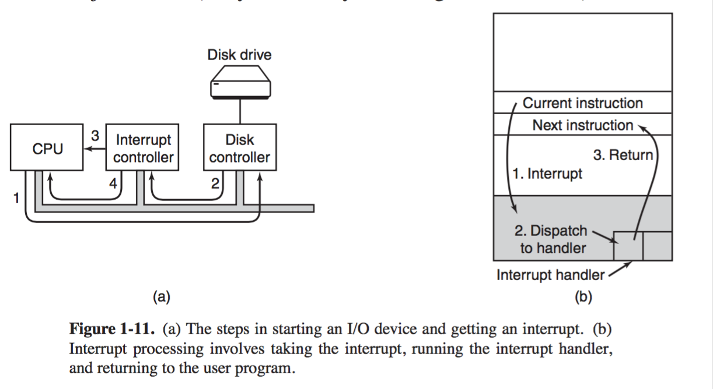
                1. driver tells conrtoller what to do by writing into its device register.controller starts device 
                2. when controller finished reading/writing it signals interrupt controller using certain buss lines 
                3. if interrupt controller is ready to accept, it asserts a pin on the CPU chip telling it.
                4. the interrupt controller puts number of device on bus so CPU can read it and know which device just finishes. 
    + _buses_ 
        + 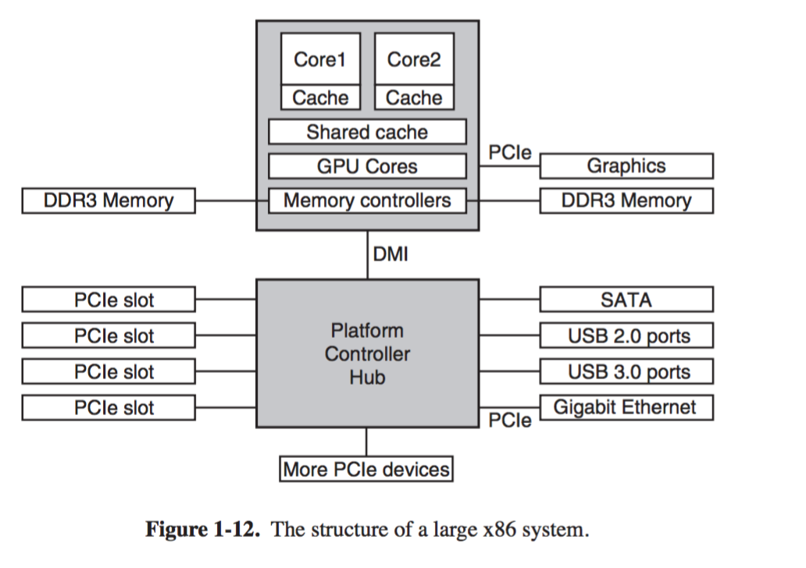
        + many buses (eg, cache, memory PCle, SATA, ...)
        + _PCIe (peripheral component interconnect express) bus_
            + main bus, capable of transferring tnes of GB/s
            + dedicated point-to-point connections (not shared) with _serial bus architecture_, that sends all bits through a single connection (lane)
                + parallelism by setting up multiple lanes
            + PCIe 2.0 -> 64Gbps 4.0 -> quadruples
            + comparison to traditional bus 
                +  _shared bus architecture_ 
                    + multiple devices use same wires to transfer data
                    + requires arbiter to determine who can use bus
                + _parallel bus architecture_ 
                    + each word of data sent over multiple wires
                    + requires all bits arrive at the same time 
            
        + _USB (universal serial bus)_ 
            + attach all slow I/O devices such as keyboard and mouse to computer 
            + not really slow... 5Gbps
        + _SCSI (small computer system interface)_ 
            + high-performance bus for fask disk, scanner, with large bandwidth
    + _Booting a computer_ 
        + _BIOS (basic input output system)_ 
            + located on motherboard, usually in _flash RAM_, which is non-volatile and modifiable should a bug occur
            + contains low level IO softward, including procedures to read keyboard, write to screem, do disk IO... 
        + BIOS checks how much RAM installed, and if other basic devices are installed and responding properly, scanning PCIe and PCI busses to detect all devices attached, new devices are configured if the devices are different from previous boot. 
        + Then checks boot device by trying a list of devices stored in memory, ( user specifiable, i.e. boot with CD-ROM or USB). If that fails, system boots from hard disk, _first sector_ from boot device is read into memory and executed 
        + program in first sector normally examines the partition table at end of boot sector to determine which partition is active 
        + secondary boot loader is read in from that partition, this loader reads in the OS from the active partition and starts it 
        + The OS queries BIOS to get config info. For each device, check if it has device driver, if not, ask user to insert CD-ROM containing the driver
        + Once it has all device drivers, OS loads them into kernel, then initializes its tables, creates whatever background processes are needed and starts up a login program or GUI
+ _The OS Zoo_ !
    + _mainframe OS_ 
        + has powerful I/O capacity. 
            + thousands of disks and millions of GB of data 
        + OS geered toward concurrent processing of many jobs at once 
        + 3 services 
            + _batch_: process  routine job without interactive user 
            + _transaction processing_: handles large amounts of small request (i.e. cheque processing, airline reservation)
            + _timesharing system_: multiple remote user to run jobs on computer at once. 
    + _server OS_
        + serve multiple users at once over a network, allow user to share hardware/software resources
    + _multiprocessor OS_ 
        + similar to server OS but requires additional features for communication, connectivity, consistency
    + _PC OS_ 
        + provide goo support to a single user
    + _handheld OS_ 
    + _embedded OS_ 
        + oven, TV, car, ... 
        + do not accept user-installed software, i.e. everything is in ROM already
    + _sensor-node OS_
    + _realtime OS_ 
    + _smartcard OS_ 
+ _OS concepts_ 
    + _processes_ 
        + _definition_: a program in execution, a container that holds all info needed to run a program with 
            + _address space_ 
                + list of memory locationn from 0 to some maximum for use
                + contains executable, program's data, its stack 
            + _a set of resources_ 
                + registers 
                + list of open files 
                + outstanding alarms 
                + lists of related processes 
        + by virtual of multi-programming, all info about a process has to be saved during suspension and later be restored the exact same previous state 
        + _process table_: holds info about processes other than its addresss space 
        + _suspended process_ 
            + _core image_: address space 
            + _process table entry_: contents of registers, and other items to restart process later 
        + _process creation/termination_ 
            + _command interpreter_ (shell): reads commands from terminal, create a new process for running command 
            + _process tree_: result of creating child processes 
                + 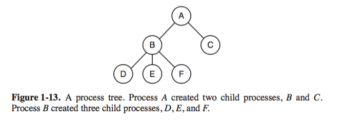
            + _interprocess communication_: communicate and synchronize their activities 
        + _signals_ 
            + software analog of hardware interrupts 
            + signal causes process to temporarily suspend its procedure, save its registers on stack, and start running a signaling-handling procedure, when finished return to the state before signal handling is called 
                + i.e. transmitting request to remote over network, may want to resend request if no acknoledgement came through
        + _UID_: 
            + process has UID of person who started it. child has same UID as its parent 
            + `superuser` has special power and may override protection rules
        + _GID_: user can ber member of groups, each of which has GID, or group identification
    + _address space_ 
        + _main memory_ 
            + holds executing programs 
            + multiprogramming system have multiple programs in memory 
            + requries mechanism for keeping programs from interfering with each other 
        + _virtual memory_ 
            + used if a process's has more address space than computer's main memory 
            + idea is to keep part of process address space in main memory and part in on disk and shuttle pices back and forth between them as needed 
    + _files_ 
        + filessytem is a clean abstracted model of the disk 
        + _directory_ 
            + grouping of files
            + oranized as trees 
        + _pathname_ 
            + characterizes a file in the directory hierarchy from the _root directory_ 
        + _current working directory_ 
            + each process has a current working direcotry, ihn which path names not beginning with a slash are looked for
        + _file descriptor_ 
        + _mounted filesystem_ 
            + deal with removable media (i.e. disk, CD-ROM, DVD, USB, SSD) 
            + 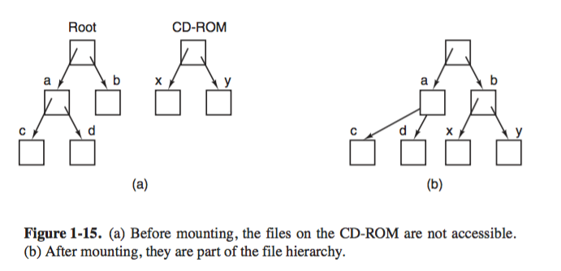
        + _special file_ 
            + make I/O devices look like files 
            + _block special files_ 
                + model device consist of a collection of randomly addressable blocks, such as disks 
            + _character special files_ 
                + model printers, modems, ... that accept or output a char stream
            + in `/dev` directory
        + _pipe_ 
            + pseudofile used to connect 2 processes. 
            + 
                + `A` writes on pipe much like writing to a file 
                + `B` reads data by reading from pipe very much like that of a file 
    + _Input/Output_ 
    + _Protection_
        + i.e. file assigned one 9-bit binary protection code. 
            + 3 3-bit field for owner, other member of group, and others 
            + for directory, `x` indicates search permission
    + _shell_ 
        + interface between a user, and OS
            + starts up on user login 
            + starts out by typing the _prompt_ (`$`)
            + creates a child process and execute any command typed 
        + not part of OS, 
+ _System Calls_ 
    + refer to the part of OS for providing abstractions to user programs 
        + mechanism of issuing syscall is highly machine dependent 
        + ~100 procedure call standardized by POSIX, most of them syscalls 
    + steps 
        + user program initiate syscall in user mode 
        + execute `trap` instuction to transfer control to OS 
        + OS figures out what calling process want to inspecting parameterrs 
        + OS OS carries out syscall in kernel mode 
        + returns control to next insturction in user mode 
    + `count = read(fd, buffer, nbytes)`
        + 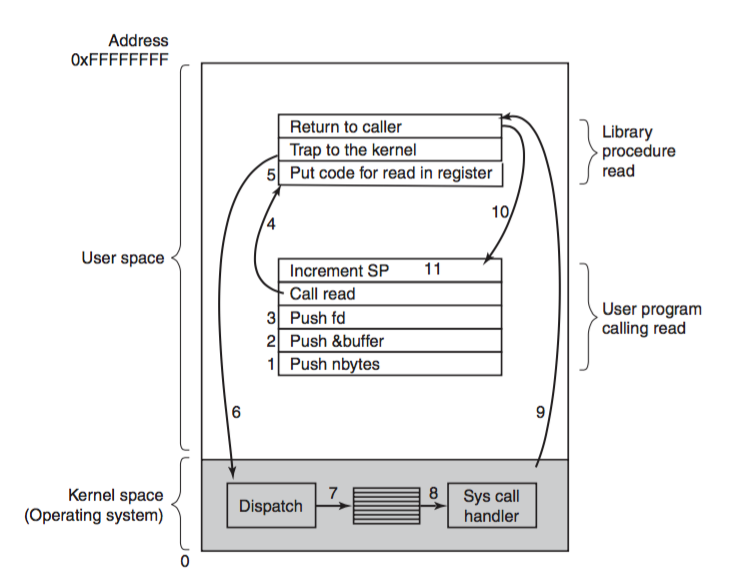
            + 1-3 first pushes parameter onto stack
            + 4-5 actual call to `read`, usually written in assembly  
                + puts syscall number in register 
                + `TRAP` to switch from user to kernel mode 
            + 6 `TRAP`
                + switches into kernel mode 
                + cannot jump to an arbitrary address, 
                    + either jumps to a single fixed location 
                    + or 8-bit field in instruction giving index into a table in memory containing jump address
            + 7-8 kernel code 
                + examines syscall number in register
                + dispatch to correct syscall handler, via a table of pointers to syscall handlers indexed on syscall number 
                + syscall handler runs
                    + _blocking_, OS may choose to run other processes
            + 8-9 return 
                + control returned to user-space `read` library 
                + control returned to user program 
    + _major POSIX syscall_ 
        + 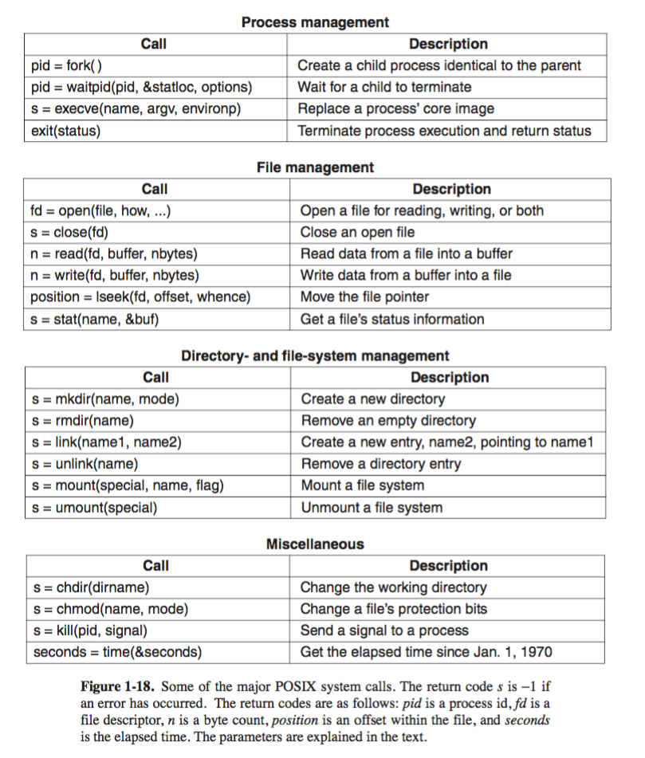
    + _process management syscall_ 
        + `fork`
            + only way to create new processes in POSIX
            + creates exact duplicates of the original process, 
                + including all `fd`, registers 
                + note program text, which is unchangeable, is shared betwen parent and child 
            + return 0 for child and `pid` of child to parent 
        + `execve`
            + cause entire core image to be replaced by the file named in its first paramter
        + `exet`
            + exit status is returned to parent via `statloc` in `waitpid` syscall 
        + _a simple shell_ 
            + 
        + _process memory_  
            + 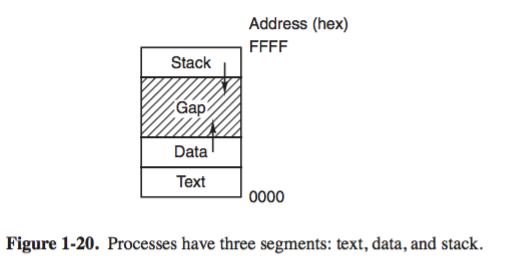
            + `text`: program code 
            + `data`: variables, grows upward
            + `stack`: grows downward
    + _file management syscall_ 
    + _directory management syscall_ 
+ _OS structure_ 
    + _monolithic systems_ 
        + 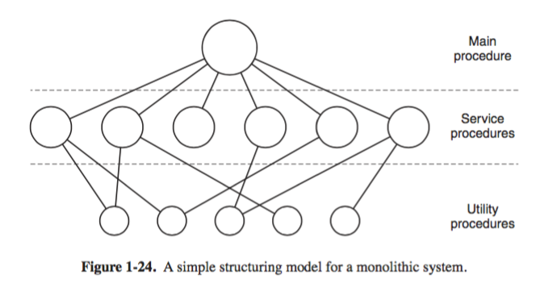
        + entire OS runs as a single program in kernel mode 
            + OS written as a collection or procedures, linked together into a single large executable binary program 
                + effienct as in any procedure can call any other
                + but hard to understand 
                + no information hiding
            + structure 
                + main program invokes requested service procedure 
                + set of service procedure carry out syscall 
                + set of utility procedure help service procedure 
            + _loadable extension_ 
                + I/O device drivers and file system 
                + UNIX _shared library_ or Windows _DLL_ (dynamic-link libraries)
    + _layered system_ 
        + generalization of monolithic system's approach 
            + inner layers beifng more priviledge than outer ones 
    + _microkernels_ 
        + achieve high reliability by splitting the OS into small, well-defined modules, only one of which - the microkernel - runs in kernel mode and the rest run as relatively powerles ordinary user processes
        + advantage 
            + better tolerance to bugs 
        + MINIX 
            + 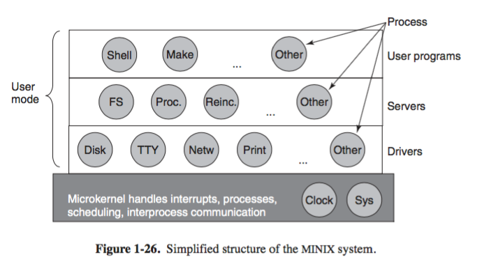
            + kernel manaages processes, handles interprocess communication, and offers 40 kernel calls 
            + outside of kernel are 3 layers of processes running in user mode 
                + device driver 
                    + do not have physical acces to IO port space, so instead build a structure telling which value to write to which IO port andf makes a kernel call telling the kernel to do the write 
                + server 
                    + file server manage file system 
                    + process manager creates destroys processes 
        + In summary 
            + _a separation of mechanism (in kernel mode) with policy (in user mode)_
    + _client-server model_
        + 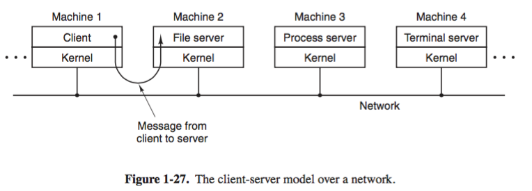
        + server provides services, and clients use these services
            + communication by message passing
        + an abstraction that can be used for a single machine or for a network of machines
    + _virtual machines_ 
        + VM/370 
            + 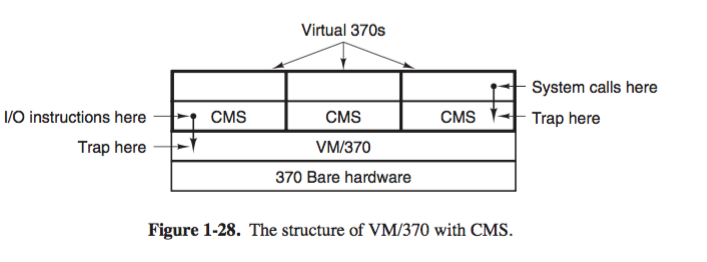
            + _virtual machine monitor_ 
                + runs on bare hardware and does multiprogramming, providing several virtual machines to the next layer up. 
                + however they are _exact_ copyies of bare hardware and not extended machines (i.e. files)
            + _CMS_ (conversational monitor system)
                + interactive timesharing user 
                + syscall 
                    + trapped to OS in its own virtual machine, not to VM/370
                    + CMS then issue normal hardware IO instructions to carry out syscall, which is trapped by VM/370
        + _hypervisors_ 
            +  
            + _type 1 hypervisor_ 
                + i.e. virtual machine monitor 
            + _machine simulator_ 
            + _type 2 hypervisor_ 
                + distinct from type 1 in that it can make use of _host operating system_ and its file system to create processes, store files 
                + can read from CD-ROM, and install guest OS on a virtual disk, which is just a big file in host OS's file system.
    + _exokernel_ 
        + an exokernel running in kernel mode, whose job is to allocate resources to virtual machines
        + each user-level VM can run its own OS, extension of VM 
        + saves a layer of mapping..  

    
## 2.1 Processes

+ _motivation_ 
    + multiprogramming system switch from process to process over a single CPU 
+ _process model_ 
    + all runnable software is organized into a number of _sequential process_ 
        + process is an instance of running program, including PC, registers, values
        + conceptually, each process has its own CPU 
    + 
        + in b) there is 4 logical PC, which is loaded into the real PC
        + Given a long enough interval, all processes made progress, but at any given instant only one process is actually running (assume single CPU)
    + Rate a process perform computation is not uniform, 
        + no assumptions can be made about timing
+ _process creation_ 
    + when process are created
        + system initialization
            + background daemon
        + execution of pocess-creation system call by a running process 
            + running process call `fork`
        + a user request to create a new process 
            _ shell commands
        + initiation of a batch job
    + `fork` 
        + only syscall in UNIX for process creation
            + child and parent have same memory image. env strings, open files,
            + however child and parent have their own distinct address space    
                + _no writable memory is shared_
                + although address are exact copies, they are not mapped to same location in main memory 
                + _copy on write_: child share all of parents memory, so whenever eihter of two modifies part of memory, that chunk of memory is explicitly copied first to the child address space
+ _process termination_ 
    + when process are terminated 
        + normal exit (voluntary): `exit`
        + error exit (voluntary)
        + fatal error (involuntary): bug
        + killed by another process (involuntary): `kill`
+ _process hierarchies_ 
    + _process group_ 
        + a process and all of its children and further descendents 
        + i.e. when a keyboard is pressed, 
            + a signal is delivered to all members of process group currently associated with a keyboard
            + each process can catch, ignore, the signal
        + i.e. `init` 
            + a special process present in the boot image 
            + forks off new process on startup to create terminal, executes a shell, ... 
            + hence `init` is the root process of all processes in the system 
+ _process state_ 
    + 
        + states
            + _running_ (using CPU)
            + _ready_ (runnable, temporarily stopped to let another process run)
                + technicalities of the system, i.e. not enough CPU to process all ready processes
            + _blocked_ (unable to run until some external event happen)
                + inherit in the problem, i.e. cannot process data until its finished reading from disk 
                + fundamentally different from first 2
        + transition 
            + running -> blocked 
                + `read` from pipe or file and no input available, process automatically blocked
            + running <-> ready 
                + managed by process scheduler 
            + blocked -> ready 
                + when external event for which a process is waiting happens
    + _scheduler_ 
        + 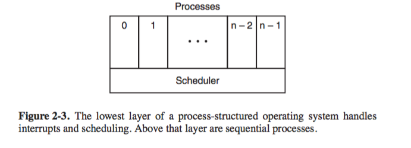
        + manages starting, stopping processes, interrupt handling, decides who and for how long a process gets CPU time 
        + this is abstracted away, and user only cares about individual processes
+ _implementation of processes_ 
    + _process table_ 
        + an array of _process control blocks_ 
    + _process conrol block_ 
        + 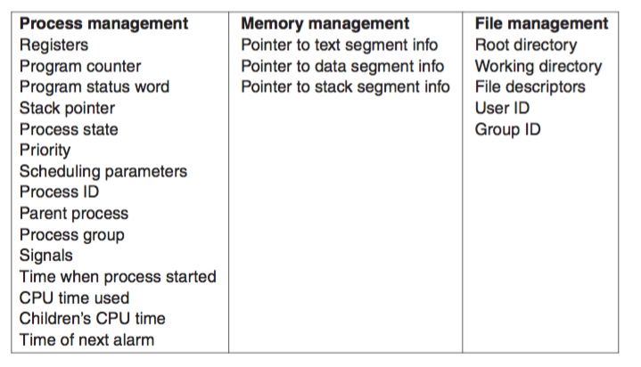
        + contains info about PC, SP, memory allocation, open file status, scheduling info, etc. 
            + all info needed when switching from _running_ to _ready_ or _blocked_
    + _illusion of multiple sequential process_ 
        + 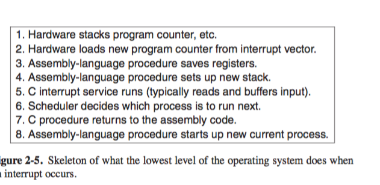
+ _modeling multiprogramming_ 
    + 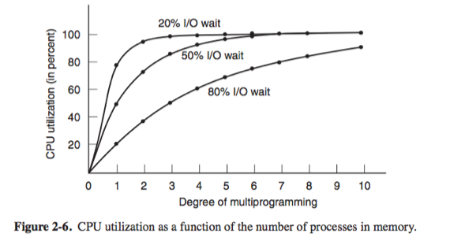
    + mainly to improve CPU utilization 
    + fromassume each process spends `p` fraction of time waitign for IO to complete, with `n` process running at once, 
        + then probability that all `n` processes are waiting for IO is `p^n`
        + then CPU utilization = `1 - p^n` 
    

        

# 2.2 threads 

+ _motivation_ 
    + multiple threads of control within the same address space running quasi-parallel 
+ _usage_ 
    + advantages
        + think about parallel processes with a shared address space, capable of sharing data amongst themselves
        + also light weighted, faster to create/destroy
        + threads offers better performance when process is part CPU bound, part I/O bound
        + useful on system with multiple CPU, real parallelism 
    + word processor example 
        + 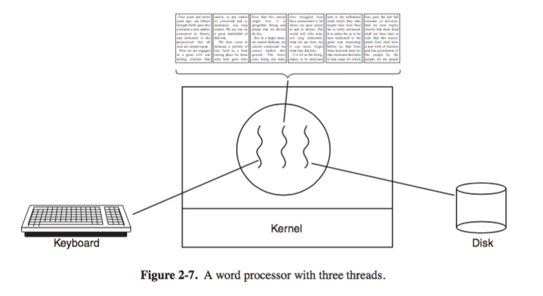
            + one thread interact with user (I/O bound)
            + one thread handles reformatting in background (CPU bound)
            + one thread that saves documents periodically
        + a single threaded word processor is blocked whenever any one of the task is working
        + three process instead of three threads doesnt work since the underlying document must be shared
    + server example 
        + 
        + 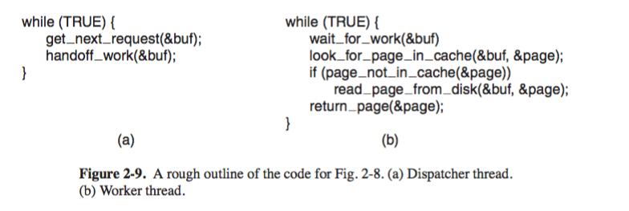
            + _dispatcher thread_ handles request and dispatches action  
            + _worker thread_ handles each request 
        + vs. single threaded server with non-blocking disk I/O
            + the server records state of current request in a table and gets next event in a loop 
            + signal/interrupt informs the single thread of completion of diks I/O, 
            + Note here states of computation must be explicitly saved and restored in the table every time server switches from working on one request to another. In effect, we are simulating threads the hard way 
        + key point 
            + able to retain idea of sequential processes that make blocking calls and still achieve parallelism 
            + blocking syscall is easy to program 
            + parallelism improves performance 
    + data processing example 
        + input thread 
        + processing thread 
        + output thread 
+ _classical thread model_ 
    + _process model_ is based on two concepts: 
        + _resource grouping_ 
            + process has address space containing program text and data, and other resources
        + _execution_
            + process has a thread of execution
            + the thread has program counter to keep track of next instruction, register for holding current working variables, stack for storing execution history
            + _threads are the entities scheduled for execution on CPU_ and could be separated with the resource grouping aspect of process 
    + _thread_ 
        + 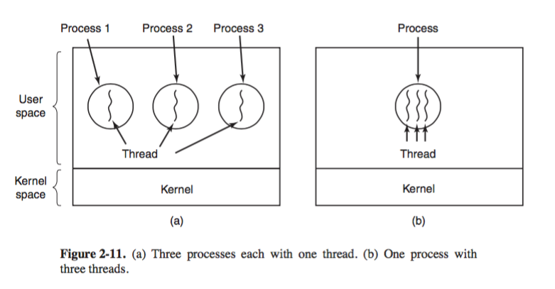
        + allows multiple execution to take place in the same process enviornment 
        + _multithreading_ with threads works in same way as _multiprogramming_ with processes 
            + CPU switches back and forth among the threads, providing illusion they are running in parallel, albeith on a slower CPU than the real one. 
            + 3 CPU-bound threads in a process would appear to be running in parallel but at 1/3 the speed of the read CPU; however a mix of CPU-bound and IO-bound threads will achieve better performance
    + _shared resources_
        + 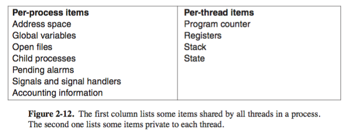 
            + _per-process item_: reflect process-dependent grouping of resources 
            + _per-thread item_: reflect properties for execution 
                + PC
                    + what to execute next 
                + registers
                    + variables during execution
                + stack: 
                    + _execution history_ 
                    + 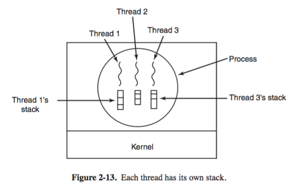
                    + necessary since each thread generally call different procedures and thus will have a different execution history
                + state: 
                    + _execution states_: _running_, _ready_, _blocked_
        + every thread can access every memory address within process's address space, 
            + no protection because 
                + it is impossible
                + not necessary, since threads are created by a sigle user to cooporate 
    + _syscalls_ 
        + `thread_create`
        + `thread_exit`
        + `thread_join`: calling thread wait (blocked) for a specific thread to exit 
        + `thread_yield`: allows a thraed to voluntarily give up CPU to let another thread run
            + important since no interrupts to enforce multiprogramming as there is with processes 
            + important to give other threads a chance to run
    + _complication_ 
        + `fork` a process with multiple threads. do child inherit threads>
        + threads shares data structure
            + what if one thread closes a file while another is still reading from it 
+ _POSIX thread_ 
    + 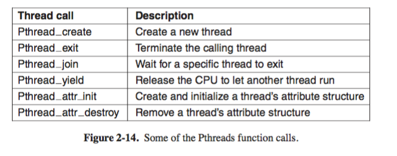
    + `pthread`
        + characterized by 
            + identifier, 
            + set of registers (including PC), 
            + set of attributes (stack size, scheduling parameters), ...
    + `pthread_create`
        + thread id returned, like `fork`
    + `pthread_exit`
        + thread terminates, stops the thread and releases its stack 
    + `pthread_join`
        + wait for specific other thread to terminate (before continuing)
    + `pthread_yield`
        + yield CPU to other thread voluntarily 
    + `pthread_attr_init`
        + creates attr structure associated with thread and init to default values, which can be changed ...
    + `pthread_attr_destroy`
        + removes thread's attr structure, freeing up its memory, (the thread continue to exist)
    + 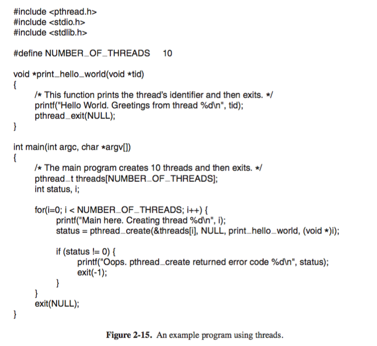
+ _implementing thread in user space_ 
    + 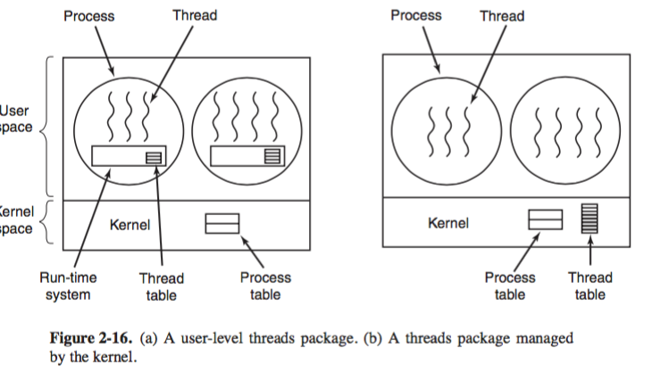
    + each process needs a private _thread table_ to keep track of thread in process
        + thread table keep track of _per-thread item_ (i.e. PC, SP, registers)
        + thread table managed by runtime system (the thread scheduler), which manages thread _execution state_, and loading/unloading of registers  
    + advantage 
        + user-level thread package can be implemented on OS that does not support threads in hardware
        + _thread scheduling_ is fast 
            + _thread switching_ is at least an order of magnitude faster than trapping to kernel 
            + no trap 
            + no kernel call 
            + no context switching 
            + no memory cache flushing
        + sheduling algorithm is determined by the user, and may be different for different processes
        + scales better (for large number of threads)
            + less table space/ stack space in user space compared to in kernel space
    + problems 
        + implementation of blocking syscall is problematic 
            + i.e. if let thread actually make `read`, then all other threads will be stopped; this is unacceptable since one major goal of threads is to let threads use blocking syscalls, but to prevnet one blocked thread from affecting others
            + _solution_
                1. change all syscall to be nonblocking, unattractiv since it require changes to OS 
                2. use `select` to make a blocking `read` to be nonblocking. runtime system allows a thread to run only if `read` is safe, i.e. does not block 
                    + requires rewriting part of syscall library, inefficient and inelegant but there is little choice
        + _page fault_ is problematic
        + no other thread will ever run unless the first thread voluntarily gives up CPU, since no clock interrupts, 
            + solution 
                + request an interrupt once a second to give runtime system control, but this is crude and messy
        + argument 
            + want thread in applications where blocking happens often 
            + so threads make a lot of syscalls 
            + but once a trap occured to kernel to carry syscall, it is hardly any more work to switch threads, if the old ones blocked, so kernel space threads eliminates the need for `select` syscall to check for safe `read` 
            + if application is essentially CPU bound, dont really need threads anyways
+ _implementing threads in kernel_
    + kernel has a thread table to keep track of all threads in system 
        + thread table keeps per-thread properties 
        + thread creation/destruction is done by making syscall to update the kernel thread table
            + create _thread pool_ to avoid overhead; marked as `blocked` when a thread terminates, and recycles the same data structure in thread table for a new thread
        + when a thread blocks, the kernel can schedule to run another thread from same process, or a thread from a different process
    + problems 
        + `fork` creates problems 
        + `signal` are sent to process, which thread should handle it.
+ _hybrid implementation_ 
    + 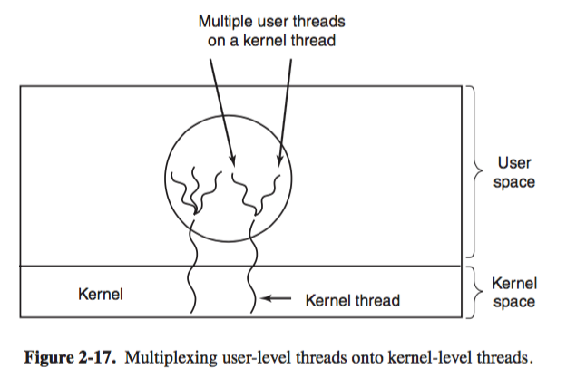
        + kernel is aware of only kernel-level threads and schedules those 
+ _pop-up threads_ 
    + 
    + handles incoming message in distributed system 
        + have a process/thread blocked on `receive` syscall waiting for incoming message 
        + when message arrvies, it processes the content 
    + alternatively, create _pop-up thread_ for each new message 
        + since threads are made brand new, no need to restore PC, SP, stack, registers, 
        + latency between message arrival and start of proecssing can be made very short
+ _making single-threaded code multithreaded_ 
    + complications 
        + variables that are global (in a sense that many procedure uses them) but other threads should logically leave them alone
            + `errno` example 
                + 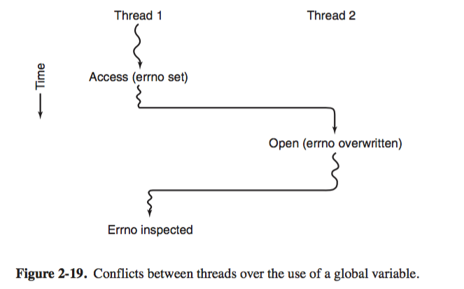
            + solution 
                + prohibit global variables 
                + assign each thread its own private global variables, i.e. own copy of `errno`
                    + 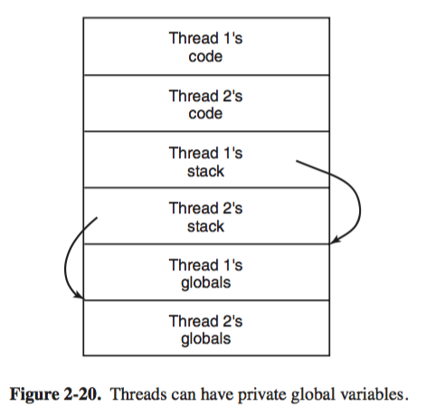
                + introduce library procedures to create, set, read threadwide global variables
                    + store on heap, accessible on a per-thread basis
        + many library procedures are not _reentrant_ 
            + _reentrant_: a function is reentrant if it is invoked, interrupted during execution and re-invoked 
                + i.e. `write`, one thread written to buffer but yet to write to file, thread switching and another thread overwrites buffer with its own data 
                + solution is to set a _jacket_ to mark the library in use, so another thread cannot be using the same library when a previous call is not completed 
        + signals 
            + which thread should be catching what signal
        + keyboards interrupts 
            + which thread catch interrupts?
        + stack management 
            + usually kernel provides processes with stack overflow automatically 
            + kernel is not aware of these stacks for user-space implemented threads, so cannot allocate thread's stack properly
