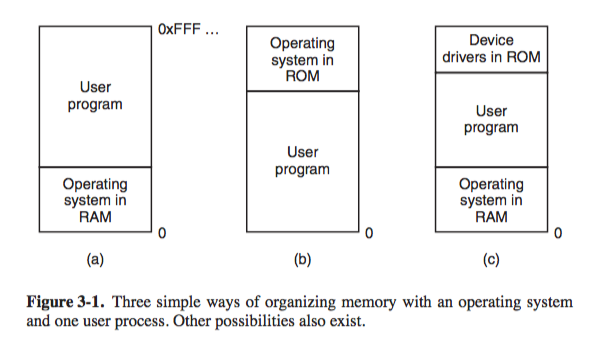
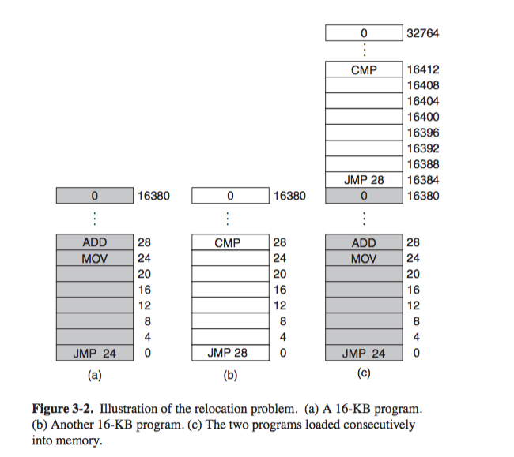
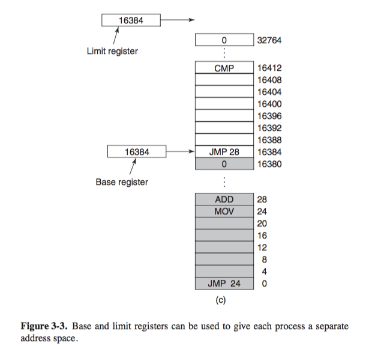
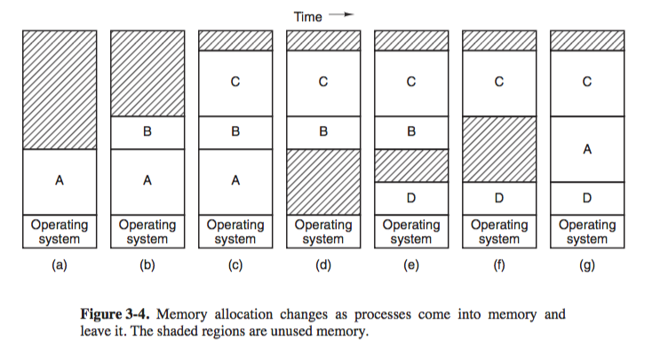
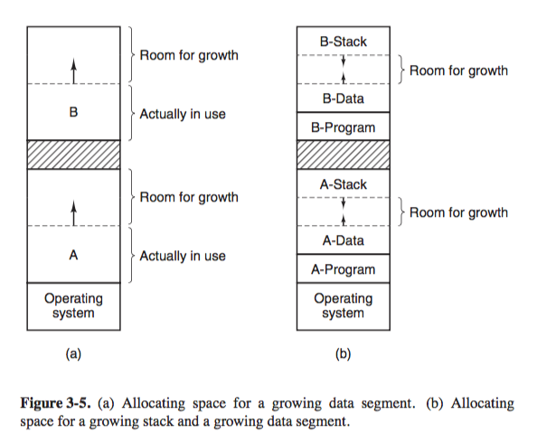
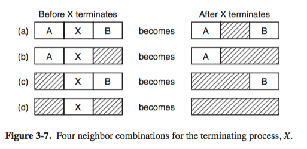
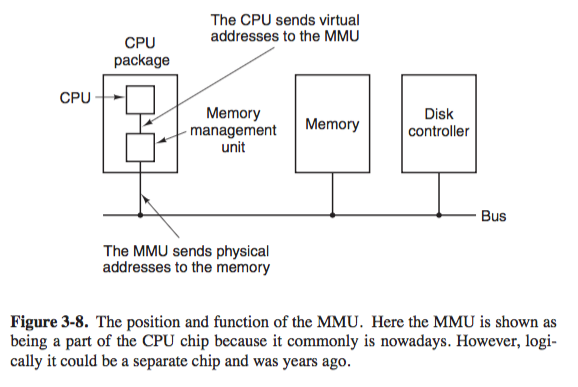
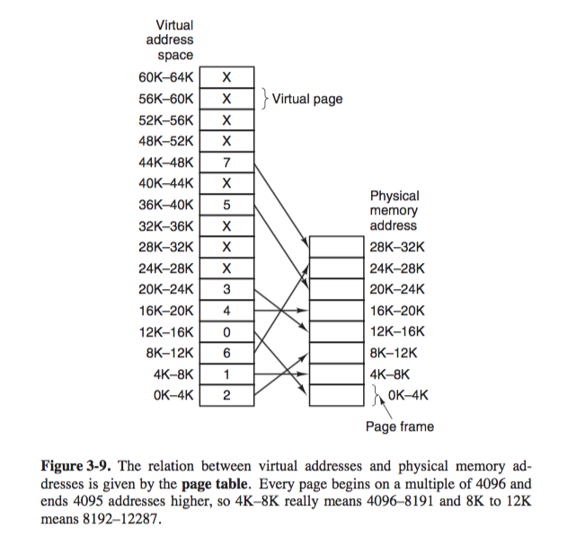
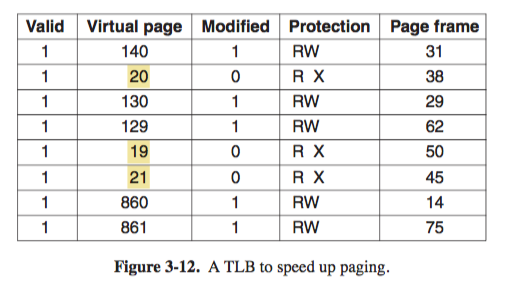
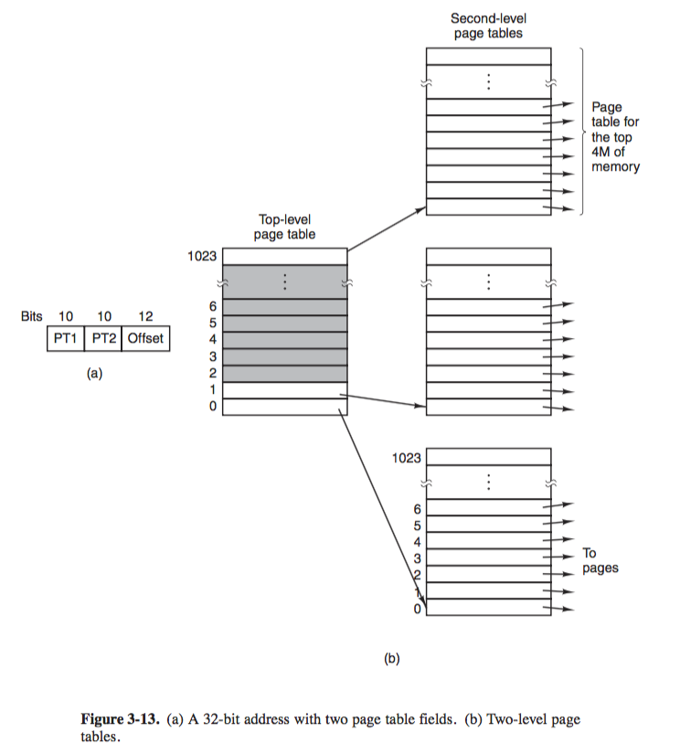

# 3.1 - 3.3 Memory Management 

> Programs expand to fill the memory available to hold them 
>                               --- Parkinson's Law

+ _the dream_
    + inexpensive, private, infinitely large, infinitely fast, nonvolatile memory 
+ _the reality_ 
    + _memory hierarchy_ 
    + 
        + few MB of very fast, expensive, volatile cache memory
        + few GB of medium speed, medium priced, volatile main memory 
        + few TB of slow, cheap, nonvolatile mgnetic/SSD storage
+ _memory manager_ 
    + part of OS that manages memory hierarchy efficiently
        + keep track of which parts of memory in use 
        + allocate memory to processes when they need it, 
        + deallocate it when they are done
    + cache memory usually done by hardware 
    + here focus on model of main memory 

### 3.1 No Memory Abstraction 

+ _no memory abstraction_ 
    + model of memory was simply physical memory, a set of addresses from 0 to some maximum, each address corersponds to a cell containing some number of bits, usually 8
        + i.e. program _saw the physical memory_ 
            + `MOV REGISTER1, 1000`
    + early computers have no memory abstraction
        + early mainframe  (1960)
        + early minicomputers (1970)
        + early PC (1980)
    + disadvantage 
        + not possible to have 2 processes in memory at same time.
            + arises when both accessing same memory location 
+ _no abstraction memory models_ 
    + 
        1. OS at bottom of memory in RAM (early mainfrae)
        2. OS at top of memory in ROM (embedded system)
        3. derive driver in ROM (i.e. BIOS) and rest in RAM (early PC)
    + problem 
        + if OS in memory alongside with userprogram, a bug in user program may crash the OS 
        + generally only one process at a time can be running 
        + may want to use thread, but cannot handle unrelated programs
+ _running multiple programs without memory abstraction_ 
    + _swapping_
        + save entire content of memory to disk file 
        + then bring in next program
        + as long as there is one program at a time in memory, no conflicts 
    + _segmented memory blocks with keys_ + _static relocation during loading_
        + idea 
            + memory divided into 2-KB blocks and each assigned a 4-bit protection key held in special registers inside CPU
                + 1MB memory requires 512 4-bit keys = 256 bytes for key storage
            + PSW (program status word) also contains 4-bit key 
            + OS
                + prevent attempts by a running proces to access memory with a protection code different from PSW key
                + _prevent processes from interfering with one another_
        + _relocation problem_
            + 
                + 2 programs are loaded into memory, 
                + execution of `JMP 28` when the second program is taking control of CPU, will execute an `ADD` operation of the first program
            + the problem  
                + both program reference absolute physical memory 
        + _static relocation_ as solution to relocation problem
            + modify the second program during its loading into memory address `16384`
            + the constant `16384` is added to every program address during the load process
            + problem 
                + slows down loading 
                + requires extra information in all executale program to indicate which word contain (relocatable) addresses and which do not.
                    + i.e. `MOV REGISTER1, 28` 28 is a constant and not an address, need a way to differentiate that 

### 3.2 A memory abstarction: Address Spaces
 
+ _motivation_ 
    + _exposing physical memory to processes_ is problematic
        + if user program can address every byte, it can trash the OS
        + difficult to have multiple program running at the same time (on a single CPU)
+ _the problems_ 
    + _protection_ 
        + multiple programs must not interfere with each other
            + e.x. previously mentioned label chunks of memory with protectio key and compare key of executing process to that of every memory word fetched.....
    + _relocation_ 
        + allow multiple programs to be in memory at same time
            + e.x. relocating programs during loading, but it is slow and complicated
+ _address space_ as a solution to protection/relocation problem 
    + a set of addresses that a process can use to address memory 
        + provides abstract memory for programs to live in 
        + each process has its own address space, independent of those belonging to other processes
    + how to give each program its own address space, so same address space in different program maps to different physical location?
+ _Ways to partition_ 
    + _fixed partition_ 
        + Divide memory into regions with fixed boundaries 
        + _internal fragmentation_: memory is wasted if process is smaller than partition
        + _overlay_: when program is larger than partition
        + _types_ 
            + equal size 
            + different queues of unequal size, assign process to smallest patition in which it will fit 
+ _base and limit register_ 
    + _motivation_ 
        + a simple solution to providing programs address space 
        + map each process' address space onto a different part of physical address akin to _dynamic relocation_ with `base` and `limit`
    + 
    + idea 
        + each CPU equipped with 2 special registers `base` and `limit`
        + programs are loaded into _consecutive_ memory locations when 
            + there is room, and
            + without relocation during loading 
        + when a process is run 
            + `base` register: loaded with physical address where its program begins in memory 
            + `limit` register: loaded with length of the program 
        + during every memory reference, either to fetch intruction of read/write data word
            + CPU automatically adds `base` to address generated by the process before sending address out on the memory bus 
            + simultaneously, it checks whether the address offered is equal to or greater than the value in the limit register, 
                + in which caes a _fault_ is generated and program aborted
    + example 
        + `JMP 28`
        + hardware adds `base = 16384` to the `28`
        + so `JMP 16412` instead 
    + disadvantage 
        + overhead in performing unnecessary during every memory reference 
            + 1 addition 
            + 1 comparison 
+ _memory overload problem_ 
    + if physical memory (RAM) is large enough to hold all processes, then `base` and `limit` register works fine
    + but if the total amount of RAM needed by all processes is often much more than can fit in memory 
        + _number_: a lot of processes in background
        + _size_: some processes are too large to fit in main memory (software bloat)
    + solutions 
        + _swapping_ 
            + bringing in each process in its entirety, running it for a while, and putting it back on disk
            + idle process are on disk, so they dont take up memory when not running 
        + _virtual memory_
            + allows programs to run even when they are partially in main memory 
+ _swapping_ 
    + 
        + note program `A` in different location in a) vs. g) 
            + implies address contained in it must be relocated 
                + software: _static relocation_ during loading 
                + hardware: _base and limit register_ during program execution
    + problems 
        + creates multiple holes in memory, waste memory 
            + _memory compaction_: combine memory holes into one big one by moving all processes downward as far as possible
                + with dynamic partitioning
            + but it is CPU intensive... so not done 
        + Program may grow in size to allow for dynamic allocation
            + fine if there free space adjacent to the memory the program occupies but problematic if adajcent to another process
                + may have to swap out other processes to make up room
                + process may have to wait if swap space is full
                + or be killed...
            + may reduce overhead if allocate a little extra memory? but how?
                + 
                + process can have heap/stack 2 growing segments
                    + stack grows down
                    + heap grows up
                + process will have to 
                    + move to a hole with sufficient space 
                    + swapped out of memory until a large enough hole can be created, 
                    + killed
+ _managing free memory_ 
    + dynamic allocation require OS to keep track of memory usage
    + solution 
        + _bitmaps_ 
        + _free lists_ 
+ _Memory Management with Bitmaps_ 
    + 
    + idea 
        + memory divided into _allocation unit_ (ranging from few words to severl kB) 
        + each allocation unit is _a bit in the bitmap_ 
            + 0 if unit is free 
            + 1 if unit is occupied 
    + _size of allocation unit is a design issue_
        + small allocation unit
            + bitmap size gets larger 
            + i.e. say allocation unit is 4bytes each, 
                + then 32bits of memory requires 1 bit of storage dedicated to bitmap. 
                + 32n bits will use n maps, bitmap will take up _1/32 of memory_ (which in a sense is OK)
        + large allocation unit 
            + appreciable memory may be wasted in the last unit of process if process size is not an exact multiple of allocation unit
    + advantage 
        + simple way to keep track of memory words in fixed amount of memory 
        + bitmap size depends on size of memory and size of allocation unit only
    + disadvantage 
        + require searching linearly in the bitmap to find `k` consecutive `0` (i.e. free) bits in the map when bring a `k`-unit sized process into memory
        + _search is slow!_
+ _Memory management with Linked List_ 
    + idea 
        + maintain a linked list of _allocated and free memory segments_
        + each entry in the list specifies 
            + a hole (`H`), or a process  (`P`)
            + address at which it starts 
            + the length 
            + pointer to next item 
        + list sorted by address 
            + updating the list when a process terminates/swapped out is easy 
                + 
                + 4 scenarios 
                    + a. replace `P` by `H` 
                    + b. and c. two entries coalesced into one
                    + d. 3 entries merged and two items removed from the list
            + hence a doubly-linked list may be better as its easier to find the previous entry and see if a merge is possible
    + _algo for memory allocation_ (assuming known how much to allocate)
        + _first fit_   
            + scans along list of segments and picks the first hole that is big enough
            + hole is broken into 2 pieces 
                + one for process 
                + one for unused memory 
            + _performance_
                + fast since searches as fast as possible
        + _next fit_ 
            + similar to first fit 
            + except keep track of where it is whenever it finds a suitable hole
            + for next allocation, the search starts from place where it left off last time 
            + _performance_ 
                + slightly worse performance than first fit 
        + _best fit_
            + searches the entire list
            + takes the smallest hole that is adequate 
            + _performance_
                + slower than first fit 
                + surprisingly, also waste more memory since it tend to fill up memory with tiny, useless holes
                + but widely used with some optimization
        + _worst fit_
            + seaches the entire list 
            + takes the largets available hole 
                + so that new hole will be big enough to be useful
            + _performance_ 
                + not a good idea... 
        + data structure improvement 
            + maintain separate list for processes `P` and holes `H` 
                + `H` list may be _sorted on size_, to make best fit faster
                    + i.e. sort list ascending, the first hole that is adequate is the best fit
                    + this way, _first fit_ and _best fit_ are equally fast, _next fit_ is pointless.
                + optimization: information stored in `H` list can be stored in the holes instead 
                    + the first word of each hole is hole size 
                    + second word a pointer to the following entry 
                    + the one bit (`P/H`) indicating hole/process is not needed, hence save space 
            + __TRADEOFF__
                + faster during memory allocation, since algo works on list for holes only
                + slower during memory deallocation, since algo have to remove entry from `P` list and insert into correc position in `H` list
        + _quick fit_ 
            + maintain separate lists for some of more common sizes requested 
            + table with `n` entries 
                + first entry a pointer to head of a list of 4-kB holes
                + second entry a pointer to a list of 8-kB holes 
                + third entry a pointer to a list of 12-kB holes 
                + holes of 21-kB could be put either in 20-kB list or on a special list of odd-sized holes 
            + _performance_ 
                + allocating memory is fast since constant time to get to list of required size
                + de-allocating memory is slow since 
                    + holes sorted by size 
                    + finding a process's neighbor to decide on if merge is possible is quite expensive 
                    + if merging not done, memory will fragment into large numbers of small holes into which no processes fit 

### 3.3  Virtual Memory 

+ _motivation_ 
    + Need to 
        + support programs that are too large to fit into memory 
        + have systems that can support multiple programs running simultaneously 
            + where each would fit into memory, but collectively exceed memory capacity
    + the alternative: _swapping_ not attractive 
        + disk transfer rate peaks several hundred MB/sec, really slow 
    + primitive solution
        + split program into piecies, _overlays_ 
        + program starts 
            + _overlay manager_ loaded 
            + overlay 0 ran 
            + when its done, the manager load overlay 1 (swapping from disk)
                + above overlay 0 if there is space 
                + on top of overlay 0 if there is no space 
        + problems 
            + programmer has to be making the choice of splitting the program into overlays 
                + which is time consuming, boring, error prone
        + virtual memory come into rescue
+ _virtual memory_ 
    + goal 
        + _virtual memory creates address space, an abstraction of physical memory_
        + _process is an abstraction of physical processor (CPU)_
    + idea 
        + each program has its own address space 
        + address space is broken down into chunks, called _pages_ 
            + each page is a _contiguous range of addresses_
            + pages are mapped onto physical memory, 
            + but not all pages have to be in physical memory at the same time to run the program
        + program reference memory access to its address space
            + if address space (i.e. page) is in memory
                + hardware performs necessary mapping on the fly 
            + if address space (i.e. page) is not in mmeory
                + OS alerted to get missing pieces and re-execute instruction that fails
    + concepts 
        + _generalization_ of base-and-limit register idea 
            + base-and-limit register, cases where there are multiple `base` register for say `text` and `data` separately
            + instead of having separate relocation for just text and data, the entire address space can be mapped onto physical memory in fairly small units
+ _paging_ 
    + a technique used in implementing virtual memory
    + 
    + idea 
        + _virtual address_: 
            + program-generated address (i.e. the address space of a process) that forms the _virtual address space_ 
            + consists of fixed-size units called _pages_, 
        + On computer without virtual memory, 
            + virtual address put directly in memory bus and causes physical memory word with same address to be read/written 
        + On computer with virtual memory, 
            + virtual address go to _MMU (Memory Management Unit)_ 
            + MMU maps virtual addresses to physical addresses, and correspondingly into _page frames_
                + if the page is unmapped, (unavoidable since virtual address space is always larger than physical address space)
                + _page fault_: CPU traps to OS 
                + the OS 
                    + picks little-used page frame and writes contents back to disk, if not already there
                    + fetches from disk the page just referenced into the page frame just freed 
                    + changes the mapping in page table 
                    + restarts the trapped instruction
        + _swapping_ 
            + transfer of page <-> page frame always in whole pages 
    + _page_ 
        + a fixed-size unit that made up the _virtual address space_
    + _page frame_ 
        + a fixed-size unit that made up the _physical address space_ 
    + _size of pages / page frames_ 
        + usually page and page frames are of same size, 4KB often used, i.e. 4096 bytes
        + size usually power of 2+ example 
            + 8196 is 16-bit `0010000000000100` in binary 
            + split into 
                + 4-bit page number: 
                    + 16 pages possible 
                    + used as index into _page table_
                    + yields a page frame corresponding to the virtual page 
                    + If `present/absent` 
                        + `0`: page fault
                        + `1`: 
                            + page frame number copied to high-order 3 bits of output register
                            + along with 12-bit offset, form a 15-bit physical address
                            + output register put onto memory bus as physical memory address
                + 12-bit offset: 4096 addressable bytes in a single page 
    + _how mapping works_ 
        + 
        + 64KB virtual address space and 32KB of physical memory 
                + we get 16 virtual pages and 8 page frames
        + _scenario 1_
            + program references a mapped address, i.e. page that have a corresponding page frame loaded in memory
            + `MOV REG, 0`, program try to access address 0
            + virtual address 0 sent to MMU
            + MMU sees that it falls in page 0 ( 0 ~ 4096 ) and is mapped to page frame 2 ( 8192 ~ 12287 ) 
            + memory oblivious of MMU and processes the mapped physical address 8192
        + _scenario 2_
            + program references an unmapped address, i.e. page that does not have a corresponding page frame in memory 
                + possible because virtual address space is larger than physical memory space, always gonna be some virtual page that is not loaded in memory 
                + Note a _present/absent_ bit keeps track of which pages are physically present in memory 
            + `MOV REG, 32780`, i.e. byte 12 in virtual page 8, 
                + virtual address 32780 sent to MMU
                + page fault occurs 
                + OS 
                    + decides to evict page frame 1
                    + load virtual page 8 at physical address 4096
                    + make changes to page table 
                        + mark virtual page 1's entry as unmapped
                        + mark virtual page 8s entry as mapped to page frame 1
+ _page table_ 
    + 
    + _purpose_ 
        + a function that maps virtual pages onto page frames
    + _how does it work_
        + _virtual address_ split into 
            + _virtual page number_ (high-order bits)
            + _offset_ (low-order bits)
            + i.e. with 16-bit address and 4KB page size, 
                + upper 4 bits specify one of 16 page numbers 
                + lower 12 bits specif byte offset within the page 
        + _virtual page number_ 
            + used as index into page table to find _page frame number_ for virtual page 
        + _page frame number_
            + attached to high-order end of offset, replacing virtual page number 
            + forms a physical address sent to memory 
+ _structure of page table entry (PTE)_
    + 
    + size 
        + 32-bits most common
    + _page frame number_
    + _Present/Absent bit_
        + `1`
            + entry is valid and can be used 
        + `0`
            + virtual page to which the entry belongs is not currently in memory 
            + causes page fault
    + _Protection bit_
        + specifies what kind of access permitted 
        + simple case: 1 bit 
            + `0`: read/write 
            + `1`: read only 
        + sophisticated case 
            + `0`: enable reading 
            + `1`: enable writing
            + `2`: enable executing 
    + _Modified and Referenced bit_
        + keep track of page usage 
    + _Modified bit_ (aka _dirty bit_) 
        + hardware automatically sets it when a page is written to (modified)
        + if has been modified _dirty_
            + must be written back to disk, to update the changes 
        + otherwise _clean_
            + the page in memory can just be abandoned since the disk copy is still valid 
    + _Referenced bit_
        + set whenever a page is referenced, either for reading or for writing
        + purpose 
            + help OS choose a page to evict when a page fault occurs 
            + pages that are not used are far better candidates than pages that are 
    + _Caching disabled bit_
        + allows caching to be disabled for the page 
        + purpose 
            + pages that map onto device registers rather than memory 
            + disable caching so that the hardware keeps fetching the word from device and not from the cached copy 
    + Note 
        + page table only holds information the hardware needs to translate virtual address to a physical address 
            + i.e. disk address used to hold page when it is not in memory is not part of the page table 
        + Information the OS needs to handle page fault is kept in tables inside OS the hardware do not need it
+ _problems with virtual memory and paging_ 
    + _mapping from virtual address to physical address must be fast_
        + important since every memory reference requires such virtual-to-physical mapping
        + each instruction may require multiple memory lookup
    + _if virtual address space is large (a tradeoff with speed), the page table will be large_
        + modern computer use virtual addresses of at least 32 bits, most likely 64-bits 
        + a 4KB = 2^12bytes page size, 32-bit address space has 2^32 / 2^12 = 2^20 ~ 1 million pages.
        + implies 1 million PTE in page table 
        + and each process needs its own page table, since virtual address space is unique to one process
+ _Speeding up virtual-to-physical translation with TLB_ 
    + _entire page table in register_ 
        + idea 
            + a single page table consisting of an array of fast hardware registers 
            + one entry for each virtual page, index by virtual page number 
            + on process start up 
                + OS loads registers with process' page table, taken from a copy kept in main memory 
            + on process execution 
                + no more memory references are needed for the page table, since everything copied to registers already 
        + advantage  
            + straightforward 
            + require no memory references during its mapping 
        + disadvantage 
            + unbearably expensive if page table is large 
            + not practical most of the time 
            + loading full page table at every context switch would kill performance 
    + _entire page table in memory_
        + idea 
            + entire page table is in memory 
            + hardware needs a single register that points to start of page table 
        +  advantage 
            + context switching has overhead of reloading one register 
        + disadvantage 
            + require one or more memory reference to read PTE during execution of each instructions 
            + execution speed generally limited by rate at which CPU can get instructions and data out of memory, reduces performance by at least half
    + _With Translation Lookaside Buffers (TLB)_: widely implemented 
        + _observation_ 
            + most program tends to make large amount of references to a small number of pages 
            + hence only a small fraction of PTE are heavily accessed in page table, the rest are barely used 
        + _TLB or associative memory_
            + hardware device for mapping virtual address to physical address without going through the page table 
                + inside of _MMU_ 
            + consists of small number (<256 usually) of entries 
                + each entry contains 
                    + virtual page number 
                    + bit that is set when page is modified 
                    + protection code (`rwx`) 
                    + physical page frame number 
                + one-to-one correspondence with fields in page table, except for virtual page number 
                    + since virtual page number is simply index in page table hence not needed there 
            + 
                + process spans 19, 20, 21, hence `R X` protection code 
                + page 129, 130 contains data being used, hence `RW`
                + 140 has indices used in array calcualtion 
                + stack on page 860, 861
        + steps 
            + MMU accepts a virtual address for translation
            + compare virtual address with all entries (in parallel with hardware support) in TLB
                + if found and does not violate protection bit, 
                    + page frame taken directly from TLB, without going to page table 
                + if found but violates protection bit  
                    + _protection fault_ generated 
                + if not found 
                    + MMU detects miss 
                    + performs an ordinary page table lookup 
                    + evicts one of entries from TLB and replaces it with page table entry just looked up 
                    + the purged entry from TLB has its _modified bit_ copied back to the page table entry in memory
                        + everything else is already in page table 
        + _software TLB management_ 
            + In RISC machines, nearly all of page management is done in software 
                + TLB entries are explicitly loaded by the OS 
                + TLB miss, 
                    + instead of MMU going to page table to find and fetch needed page reference 
                    + just generates _TLB fault_ and CPU trap to OS, which (instead of MMU) finds the PTE in page table, remove and replace an entry from TLB, and restart an instruction that faulted. 
            + _performance_ 
                + if TLB is moderately large (64 entries) to reduce miss rate 
                + sortware management is sufficiently efficient
                + idea is to free area in CPU chip for caches and other features...
            + _ways to decrease miss rate_ 
                + increase TLB size, obviously
                + OS may try to figure out what pages are likely to be used next, and to _preload entries_ for them in TLB
                    + i.e. 
                        + client process sends message 
                        + very likely server will run soon 
                        + check server's code, data, stack pages and map them before they get a change to cause TLB faults
                + use _software cache_
                    + when TLB miss happens, the pages holding the page table might not be in TLB (happens in software), which causes adidtional faults during the process 
                    + can be reduced by maintaining a large (4KB) software cache of TLB entries in a fixed location whose page is always kept in the TLB
                        + so put pages storing the page table in the software cache
                    + OS can reduce TLB miss by checking the software cache first
            + _types of misses_ 
                + _soft miss_ 
                    + page referenced is not in TLB, but is in memory 
                    + only need to update TLB
                    + no disk IO
                + _hard miss_ 
                    + page referenced not in TLB, and not in memory 
                    + disk access required to bring in the page 
                    + million times more slower than soft miss 
                + _other misses_ 
                    + _page table walk_ 
                        + looking up mapping in the page table hierarchy 
                            + TLB 
                            + software cache 
                            + memory 
                            + disk 
                    + say page table walk does not find page in process' page table 
                        + page fault 
                        + 3 possibilities 
                            + _minor page fault_, a _pretty soft miss_
                                + page may actually be in memory, but not in process' page table 
                                + i.e. brought to memory by another process 
                                + just have to remap the page appropriately in page tables
                            + _major page fault_ 
                                + if page needs to be brought in from disk 
                            + _segmentation fault_ 
                                + program simply accessed an invalid address, no mapping needs to be added in TLB at all
                                + program is killed 
+ _Page tables for large virtual address space_ 
    + _Multilevel page tables_ 
        + 
            + 32-bit virtual address partitioned into 
                + a 10-bit `PT1` field
                + a 10-bit `PT2` field 
                    + implies 2^20 pages 
                + a 12-bit `Offset` field, 
                    + implies page size 4KB
            + _top-level page table_ 
                + 1024 enties, indexed by 10-bit `PT1`
                + each entry holds address to second-level page table 
                + each entry represent a 4MB chunk
                    + 2^22 bytes = 4MB
            + _second-level page table_ 
                + index by 10-bit `PT2`
                + each entry holds the page frame number 
            + example 
                + `0x00403004` i.e. `4206596` in decimal 
                + `PT1 = 1` used to index top level table 
                + `PT2 = 3` used to index second level table 
                + finds the page frame number 
                    + if page not in memory, _present/absent_ is 0
                        + page fault 
                    + if page in memory, page frame number taken from second-level page table is combined with offset to construct the physical address  
                + address put on bus and send to memory
        + idea 
            + avoid keeping all page tables in memory at all time 
            + MMU gets virtual address 
                + extract `PT1` field and uses this value as index into top-level page table 
                + use the resulting address to index into second-level page table, which contains the page frame number itself
        + usage 
            + Intel 32 bit processor in 1985: 2 level page table 
                + a _page directory_ bound to 1024 page table 
                + each page table points to 1024 4KB page frames 
                + giving a total of `2^10 X 2^10 X 2^12 = 2^32` addressable bytes 
            + AMD 64-bit processor 
                + 512 entries in all tables, there are 4 page table, each page 4kb in size 
                + (2^9)^4 X 2^12 = 2^48 bytes 
    + _Inverted page table_ 
        + idea 
            + one entry per page frame in real memory, rather than one entry per page of virtual address space 
            + i.e. a 64-bit virtual address, a 4KB page size, and 4GB of RAM, an inverted page table requires only 1M entries, 
                + `2^32 (4GB) / 2^12 (4KB) = 2^20 = 1048576 (1MB)` 
        + advantage 
            + saves space when virtual address space is large 
        + disadvantage 
            + virtual-to-physical translation is hard 
                + when trying to access virtual page `p`, 
                + cannot use `p` as index into page table any longer 
                + instead have to search the entire inverted page table for entry
            + such search has to be done at every memory reference 
            + use _TLB_ to remedy this