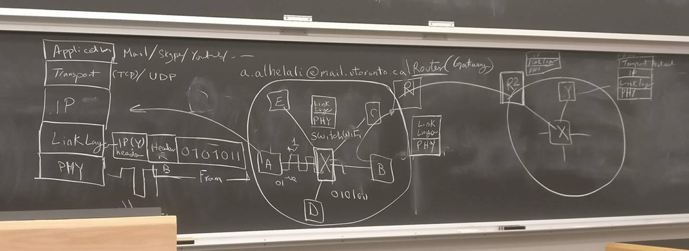
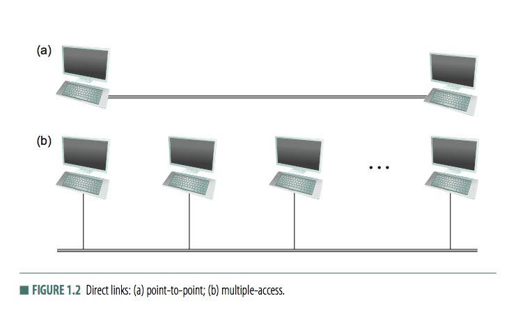
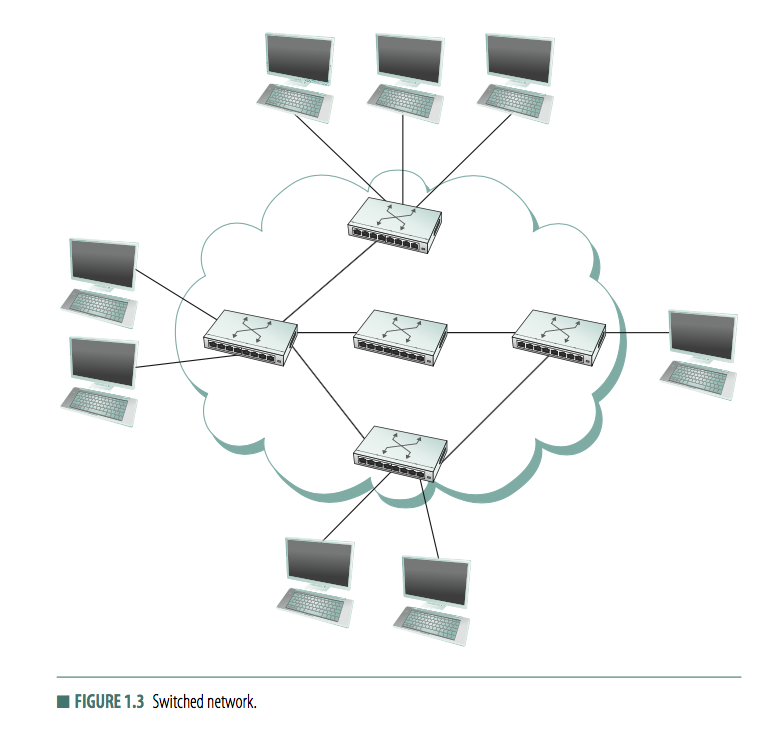
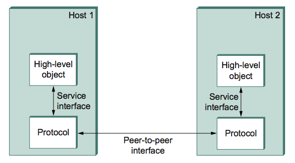

+ _physical layer_ 
    + physical wire (of voltage) or wifi 
+ _link layer_ 
    + metadatas (headers) for directing information (i.e. destination) within a network
+ _IP layer_ 
    + adds IP headers for directing information between networks
+ _transport protocol_ 
    + inform which application initiates the data transmission
    + different protocols depending on different goals
        + video: UDP  (fast, maybe packet loss)
        + mail: TCP (secure, everything sent)
+ _application layer_ 
    + i.e. mail, skype, youtube,...

+ _networks_     
    + communication between networks mediated by a _router_ (gateway)
        + the link layer headers directs to the router
        + the IP layer headers directs to the destination in another network
+ _switch_ 
    + a server that dispatches information to a collection of clients
    + needs to support
        + physical layer
        + link layer 
    + usually implemented in hardware, for cost-effectiveness
+ _router_ 
    + relay information between one network to another
    + _supports_ 
        + physical layer
        + link layer 
        + IP layer
+ _server/client_ 
    + need to support 
        + physical layer 
        + link layer
        + IP layer 
        + transport
        + application layer
+ _note_ 
    + different devices doesn't need to support layers that it doesnt require

--- 

### Chapter 1 Foundation

#### 1.1 Applications 

+ _application_ 
    + web pages
    + streaming 
    + voice-over-IP (skype) 
        + tighter timing constriant

#### 1.2 Requirements 

+ _Scalable Connectivity_
    + _terminology_
        + 
        + _link_ 
            + physical medium  (cable, optical fiber) that connects computers
        + _node_
            + computers link connects 
        + _point-to-point_
            + physical links limited to a pair of nodes
        + _multiple-access_ 
            + more than 2 nodes may share a single physical link (WIFI)
            + usually limited in size
        + _cooperative-connectivity_
            + indirect connectivity achieved amongst a set of coorperating nodes
    + _switched network_ 
        + 
        + a set of nodes, each attached to one or more point-to-point links 
        + _switches_ 
            + or _forwarding nodes_, nodes that implements the network 
            + nodes that forward data received on one link out on another 
        + _hosts_ 
            + nodes that use the network
        + _circuit switched_
            + telephone
            + must establish a dedicated circuit across a sequence of links and then allows the sourec node to send a stream of bits across this circuit to a destination node
        + _packet switched_ 
            + computer networks 
            + nodes in network sends discrete blocks of data, or _packet_, to each other 
            + _store-and-forward_ 
                + each node receive a complete packet over some link
                + stores packet in internal memory
                + forward to next node 
    + _Internetwork (internet)_ 
        + 
        + a set of independent networks interconnected 
            + `i` for generic internetwork of networks 
            + `I` for TCP/IP network 
        + _router/gateway_ 
            + node that is connected to 2 or more networks 
            + forwards messages from one network to another
        + _address of node_ 
            + a byte string that identifies a node 
            + network can use node's address to distinguish from other nodes 
            + maybe used by swithes/routers to decide how to forward the message 
        + _routing_ 
            + process of determining systematically how to forward messages toward the destination node based on its address
        + _unicast_ 
            + the source node wants to send a message to a single destination 
        + _broadcast_ 
            + the source node wants to send a message to more than 1 destination
+ _Cost-effective resource sharing_  
    + _multiplexing_ 
        + 
        + a system resource (physical link) is shared among multiple users
            + and then demultiplexed back into separate flows 
    + _methods for multiplexing_ 
        + _synchronous time-division multiplexing (STDM)_
            + divide time into equally-sized quanta and, in round-robin fashion, give each flow a chance to send its data over the physical link
        + _freuqency-division multiplexing (FDM)_
            + transmit each flow over the physical link at a different frequency
        + _limitations of STDM and FDM_ 
            + if flows does not have any data to send, the share of physical link/ time quantum or frequency remains idle
            + max number of flow is fixed and known ahead of time
                + cannot resize quanta
        + _solution: statistical multiplexing_ 
            + physical link is shared over time like STDM, but data is transmitted from each flow on demand rather than during a predetermined time slot,
            + _properties_ 
                + efficient, as it ensures no channel will go waste
                + flexible, as it allows link to be divided among a variable number of channels
                + however, delay time is not determinstic as in STDM
            + _consider_
                + cant ensure that all flows eventually get their turn to transmit over the physical link
                + so defines an upper bound on the size of block of data that each flow is permitted to transmit at a given time
                + _packet_ 
                    + the limited-size block of data 
                    + implies may need to fragment message to meet the size limit
                + _message_ 
                    + arbirtarily large that application might want to transmit 
            + _decision as to which packet is transmitted is on a per-packet basis_ 
                + 
                + so, concurrent flows will have packets interleaved on the physical link
            + _decide which packet to send_ 
                + _FIFO_
                + _round-robin_
            + _congestion_ 
                + a switch may have to buffer packets if line is busy 
                + if a switch receive packets faster tha it can send them for some time, buffer will run out
                + some packets will have to be dropped -> congested
+ _Support for common service_ 
    + _motivation_ 
        + network is complex, which strains application developer
        + network designer build common services, aim to hide complexity of network from application 
    + _solution: channels_    
        + 
        + network provides logical _channels_ over which application-level processes can communiate with each other
        + like a pipe that connects 2 applications over the network 
        + different channels focus on certain functionality 
            + order of data
            + timing of transmission
            + integrity of data 
            + security
    + _File transfer protocol (FTP)_ or _Network file system (NFS)_
        + _goal_
            + a pair of processes
            + _client_: one process requests that file be read/written 
            + _server_: a second process that honors this requests
    + _request/reply channel_ 
        + ensures requests are sent and only one copy of message is delivered 
        + protect privacy and integrity of data 
    + _message stream channel_ (video records)
        + supports different delay property 
        + does not need to guarantee all messages delivered, 
            + since video is fine even if some frames missing 
        + but have to ensure messages delivered arrive in the same order in which they were sent
        + might want to support multicast (teleconferencing)
+ _Reliability_ 
    + _Types of problems_ 
        + _bit error_ 
            + packet have 1 turned to 0 or vice versa 
            + _cause_   
                + outside forces 
            + fairly rare 
        + _packet loss_ 
            + a complete packet is lost by the network 
            + _cause_ 
                + contains bit error, so discarded, or
                + overloaded forwarding nodes drops the packet 
                + software bug, cause packet to forward to incorrect destination 
            + _have to distinguish lost packet vs. delayed packet_
        + _failed node/link_ 
            + physical link cut or computer crashes
            + _cause_ 
                + power failure
                + software crash 
            + _may reroute packets around a failed node/link_
+ _Manageability_ 
    + _motivation_ 
        + want to make changes to network to make it scale 

#### 1.3 Network Architecture

+ _Layering and Protocols_ 
    + _abstraction_ 
        + hiding details behind a well-defined interface
    + _layering for networking_     
        + 
        + 
    + _protocols_  
        + provides 
            + a communication service is exports locally as _service interface_, and 
            + set of rules governing messages that the protocol exchanges with its peers to implement the _peer service_
        + the abstract objects that make up the layers of a network system 
        + _example_ 
            + a request/reply protocol
            + a message stream protocol
        + _two interfaces_ 
            + 
            + _service interface_ 
                + used by other objects on the same computer that want to use the communication service 
                + i.e. HTTP protocol support operation to fetch HTML from a remote server
            + _peer interface_ 
                + used by objects on other machines (peer) 
                + defines the form and meaning of messages exchanged between protocol peers to implement the communication service
                + i.e. HTTP protocol defines how a `GET` command is formatted, what args can be used with the command, and how a server should respond
    + _protocol graph_ 
        + _motivation_ 
            + peer-to-peer communication is usually indirect 
            + maybe different protocols at any given level (providing different services)
        + _nodes_ 
            + represent protocols 
        + _edges_ 
            + a _depend on_ relation
        + 
            + _RRP: request/reply protocol_ 
                + provides a type of P2P channel
            + _MSP: message stream protocol_
                + provides a type of P2P channel
            + _HHP: host-to-host protocol_
                + provides connectivity service
            + _steps_ 
                + file application asks RRP to send message 
                + RRP invokes service of HHP, to send message to its peer 
                + HHP on end host passes message up to RRP, which translates message to file application on remote machine
        + _protocol stack_
            + a set protocols that an application employs
    + _protocol specification_ 
        + abstract interfaces, i.e. operations defined by the service interface and the form and meaning of messages exchanged between them  
    + _protocol module_ 
        + implementations of a protocol specification
    + _network architecture_ 
        + the set of rules governing the form and content of a protocol graph 
        + IETF/ISO standardize rules
+ _Encapsulation_ 
    + _request/replay protocol (RRP)_ 
        + sees an array of bytes, does not care about what data is sent, 
        + attach a _header_ to the message
            + instruct peers how to handle the message
            + usually to the begining of message 
        + _header_
            + a data struture used among peers to communicate with each other 
            + defined by protocol specification
        + _body (payload)_ 
            + rest of the message, 
        + _encapsulation_ 
            + application data is enapsulated in the new message created by RRP
    + 
        + _encapsulation_ is repeated at each level of the protocol graph 
        + _result_ 
            + resulting message are equivalent 
        + _observation_ 
            + low-level protocol does not interpret message given by high-level protocol
+ _Multiplexing and Demultiplexing_ 
    + _packet switching_   
        + multiplex multiple flows of data over a single physical link, 

P31 tbc...