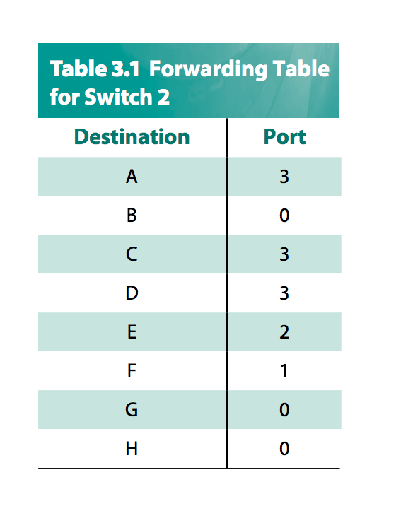

+ IP address classes 
    ```
    // class A
    0,1000000 xxxxxxxx xxxxxxxx xxxxxxxx
    0,1000001 xxxxxxxx xxxxxxxx xxxxxxxx
    0,1000010 xxxxxxxx xxxxxxxx xxxxxxxx
    0,1000011 xxxxxxxx xxxxxxxx xxxxxxxx
    ```
    + _note_
        + first 1 bit, indicate _class_
        + next 7 bit, for _network-ID_
            + 2^7
        + next 3 bytes, for _host-ID_
            + 2^24 - 2
            + cant use all zero or all ones for host-ID
    + _3000 hosts need_
        + choose `B`, waste lots of host address
        + choose multiple `C`, so have multiple IPs for the same company
        + idea is to use _subnetting_ 
+ _subnetting_ 
    ```
    // IP addr -> binary
    192.168.10.1
    11000000.10101000.00001010.00000001
    // subnet mask  -> binary
    255.255.255.0 
    11111111.11111111.11111111.00000000
    // IP x mask
    11000000.10101000.00001010.00000000
    ```
    + _note_ 
        + `255` in binary is all ones
        + _network address_ 
            + `IP x mask`
        + `255.255.255.0`
            + can connect to 254 computers
    ```
    // mask
    11111111.11111111.11111111.11111000
    ```
    + _note_ 
        + `IP` is a class C address
            + first 3 bytes fixeds
            + but can change the last 8 bytes however you wnat
        + _mask_ 
            + changed to `255.255.255.248`
            + can also be specified as `192.168.10/29`, for 29 bits of network-ID
        + last byte 
            + first 5 bits used for subnets
            + last 3 for host-ID
        + _idea_ 
            + can create 2^5 subnetworks   
                + CS dept: 00000
                + ECE dept: 00001
            + each containing 2^3 - 2 = 6 hosts


A | # of hosts
---| ---- 
A | 16777214 (2^24 - 2)
B | 65534 (2^16-2)
C | 254 (2^8 - 2)


+ _classless interdomain routing (CIDR)_ 
    ```
    
                    |--- internet   128.9.14.0/23
    128.9.14.0/24   | 
            --  (Router) --  128.9.15.0/24
            |             |
          Net1           Net2
    ```
    ```
    // Net1
    10000000.00001001.00001110.00000000
    // Net2
    10000000.00001001.00001111.00000000
    ```
    + _note_ 
        + `R` owns both network IP 
            + able to forward packet to both IP 
            + so to the rest of internet `R` has `IP` of `128.9.14.0/23`


--- 


# Chapter 3

+ _motivation_ 
    + ethernet connect to no more than 1024 hosts, P2P connects only 2
    + need ways to interconnect different types of lins and networks
    + _switch_  
        + device that interconnect links 
        + _bridges_ 
            + subclass of switch that connects Ethernet segments
        + take packet in and _forward_ them to the right output
    + _gateway (router)_
        + device that interconnect disparate networks and links
        + IP..
    + _Routing_ 
        + find an efficient, loop free, dynamic path through a network 

#### 3.1 Switching and Bridging


+ _switching_ 
    + mechanism to interconnect links to form a large network 
+ _switch_
    + _definition_
        + multi-input, multi-output device that _transfer packets_ from one input to 1/more outputs
        + _switching/forwarding_ packet from input to output
    + _star shaped topology_
        + 
        + Can interconnect switches with P2P links, so can build network of alrge geographical scope
        + _more scalable than shared-media network_
    + _how to forward_ 
        + _datagram (connectionless)_ 
        + _virtual circuit (connection-oriented)_
    + _assumption_ 
        + global uniqueness of _addresses_
        + we can identify ports with number/nearest host
+ _Datagram_ 
    + _idea_ 
        + 
        + 
        + each packet contains complete destination address
        + switch consult _forwarding table_ for the lik to forward packets to
    + _characteristics_ 
        + _connectinoless_ 
            + a host can send a packet anywhere anytime 
        + host has no way of knowing if network is capable of delivering it or if destination host is up and running 
        + each packet forwarded independently of previous packets 
            + may forward via different route
        + switch or link failure might not have any serious affect on communication 
            + if its possible to find an alternate route around the failure
            + _robust_
+ _Virtual circuit switching_ 
    + 
    + _idea_ 
        + requires setting up virtual connection from source to destination before data is sent
    + _two phases_ 
        + _connection phase_ 
            + set up entries in a _VC table_ in each swtiching through which the connectino passes
            + _contains_ 
                + _virtual circuit identifier (VCI)_ 
                + incoming interface 
                + outgoing switch 
                + potentially VCI used for outgoing packets 
            + packet arrrives, 
                + search by incoing interface with matching VCI value in header 
                + forward with specifiied outgoing interface
    + ...

+ _Bridges and Lan switches_ 
    + _hub_
        + accept LAN frames as inputs and foward them out on all other outputs
    + _bridges_ 
        + a class of switches that forward packets between LANs (local area networks) such as ethernet
        + similar in functionality to switches, also extends total bandwidth of a network
        + forms a _extended LAN_
    + _vs. repeater_ 
        + repeater may exceed physical limitation of ethernet 
    + _learning bridges_
        +  
        + _observation_ 
            + bridge does not need to forward all frames (i.e. ignore frames sent from the same LAN)
        + _idea_ 
            + let each bridge inspect _source_ address in all frames it receives, 
        + _example_ 
            + when A sends frame to host on either side of bridge
            + bridge receives this frame records the fact that a frame from host A was just received on port 1
        + _steps_ 
            + table is initially empty
            + timeout associated with each entry added
        + _flooding_  
    + _spanning tree algorithm_ 
        + _motivation_ 
            + learning bridge is problematic if loops exists in the network
            + we would have flooding cycling around in a loop (both directions) without ever stopping
        + 
            + _steps_
                + packet enter B4 via J
                + _destination address in any bridge's forwarding table_
                + B4 sends a copy to ethernet H and I
                + B6 forwards packets to ethernet G
                + B1 then forward back to ethernet Hs
                + B4 still doesnt have destination in its table, so forward packet back to ethernet I and J
                + cycle goes on
        + _distributed MST algorithm_ 
            + 
            + 