+ IP address classes 
    ```
    // class A
    0,1000000 xxxxxxxx xxxxxxxx xxxxxxxx
    0,1000001 xxxxxxxx xxxxxxxx xxxxxxxx
    0,1000010 xxxxxxxx xxxxxxxx xxxxxxxx
    0,1000011 xxxxxxxx xxxxxxxx xxxxxxxx
    ```
    + _note_
        + first 1 bit, indicate _class_
        + next 7 bit, for _network-ID_
            + 2^7
        + next 3 bytes, for _host-ID_
            + 2^24 - 2
            + cant use all zero or all ones for host-ID
    + _3000 hosts need_
        + choose `B`, waste lots of host address
        + choose multiple `C`, so have multiple IPs for the same company
        + idea is to use _subnetting_ 
+ _subnetting_ 
    ```
    // IP addr -> binary
    192.168.10.1
    11000000.10101000.00001010.00000001
    // subnet mask  -> binary
    255.255.255.0 
    11111111.11111111.11111111.00000000
    // IP x mask
    11000000.10101000.00001010.00000000
    ```
    + _note_ 
        + `255` in binary is all ones
        + _network address_ 
            + `IP x mask`
        + `255.255.255.0`
            + can connect to 254 computers
    ```
    // mask
    11111111.11111111.11111111.11111000
    ```
    + _note_ 
        + `IP` is a class C address
            + first 3 bytes fixeds
            + but can change the last 8 bytes however you wnat
        + _mask_ 
            + changed to `255.255.255.248`
            + can also be specified as `192.168.10/29`, for 29 bits of network-ID
        + last byte 
            + first 5 bits used for subnets
            + last 3 for host-ID
        + _idea_ 
            + can create 2^5 subnetworks   
                + CS dept: 00000
                + ECE dept: 00001
            + each containing 2^3 - 2 = 6 hosts


A | # of hosts
---| ---- 
A | 16777214 (2^24 - 2)
B | 65534 (2^16-2)
C | 254 (2^8 - 2)


+ _classless interdomain routing (CIDR)_ 
    ```
    
                    |--- internet   128.9.14.0/23
    128.9.14.0/24   | 
            --  (Router) --  128.9.15.0/24
            |             |
          Net1           Net2
    ```
    ```
    // Net1
    10000000.00001001.00001110.00000000
    // Net2
    10000000.00001001.00001111.00000000
    ```
    + _note_ 
        + `R` owns both network IP 
            + able to forward packet to both IP 
            + so to the rest of internet `R` has `IP` of `128.9.14.0/23`


--- 


+ _bridges, switches, and routers_ 
    + _bridge_ 
        + link-level nodes
        + forward _frame_ from one link to another to implement extended LAN 
    + _switches_ 
        + network-level nodes
        + forward _packet_ from one link to another to implement packet-switched network 
        + usually network is homogeneous
    + _router_
        + internet-level nodes, 
        + forward _datagrams_ from one network to another to implement internet
        + usually network is heterogeneous
+ _discussion_ 
    + _bridge vs switches_ 
        + distinction obscured
            + i.e. multiport bridge is a ethernet switch or LAN switch
        + both are _layer 2 devices_ 
    + _switches vs routers_ 
        + distinguished by sort of datagram it forwards
        + switch forwards _layer 2 packets_ while router forwards _IP datagram_ 


--- 

# Chapter 3

+ _motivation_ 
    + ethernet connect to no more than 1024 hosts, P2P connects only 2
    + need ways to interconnect different types of lins and networks
    + _switch_  
        + device that interconnect links 
        + _bridges_ 
            + subclass of switch that connects Ethernet segments
        + take packet in and _forward_ them to the right output
    + _gateway (router)_
        + device that interconnect disparate networks and links
        + IP..
    + _Routing_ 
        + find an efficient, loop free, dynamic path through a network 

#### 3.1 Switching and Bridging


+ _switching_ 
    + mechanism to interconnect links to form a large network 
+ _switch_
    + _definition_
        + multi-input, multi-output device that _transfer packets_ from one input to 1/more outputs
        + _switching/forwarding_ packet from input to output
    + _star shaped topology_
        + 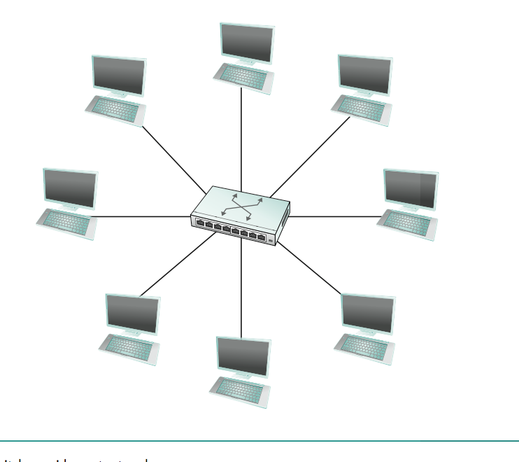
        + Can interconnect switches with P2P links, so can build network of alrge geographical scope
        + _more scalable than shared-media network_
    + _how to forward_ 
        + _datagram (connectionless)_ 
        + _virtual circuit (connection-oriented)_
    + _assumption_ 
        + global uniqueness of _addresses_
        + we can identify ports with number/nearest host
+ _Datagram_ 
    + _idea_ 
        + 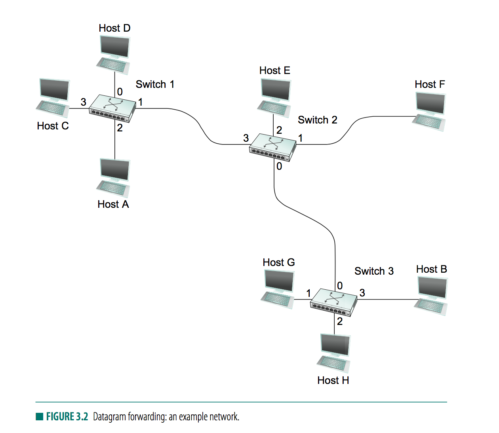
        + 
        + each packet contains complete destination address
        + switch consult _forwarding table_ for the lik to forward packets to
    + _characteristics_ 
        + _connectinoless_ 
            + a host can send a packet anywhere anytime 
        + host has no way of knowing if network is capable of delivering it or if destination host is up and running 
        + each packet forwarded independently of previous packets 
            + may forward via different route
        + switch or link failure might not have any serious affect on communication 
            + if its possible to find an alternate route around the failure
            + _robust_
+ _Virtual circuit switching_ 
    + 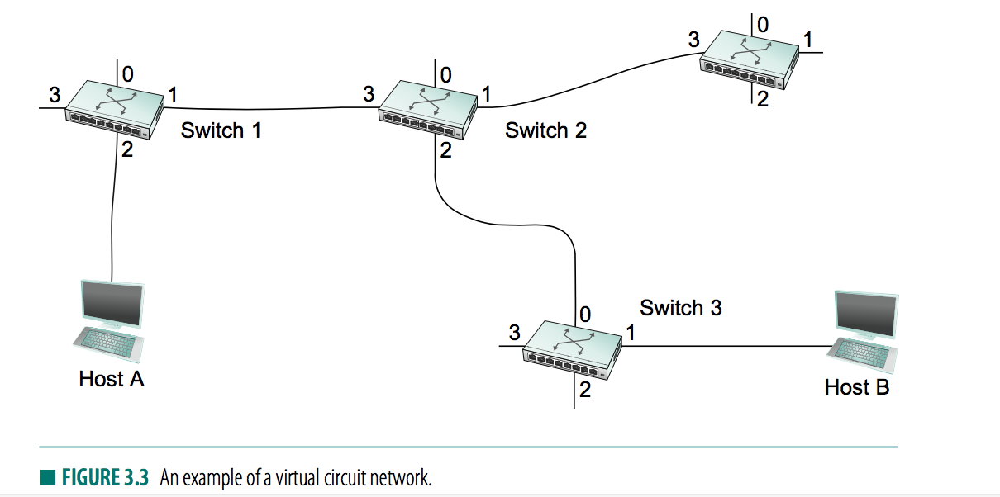
    + _idea_ 
        + requires setting up virtual connection from source to destination before data is sent
    + _two phases_ 
        + _connection phase_ 
            + set up entries in a _VC table_ in each swtiching through which the connectino passes
            + _contains_ 
                + _virtual circuit identifier (VCI)_ 
                + incoming interface 
                + outgoing switch 
                + potentially VCI used for outgoing packets 
            + packet arrrives, 
                + search by incoing interface with matching VCI value in header 
                + forward with specifiied outgoing interface
        + _VCI_ 
            + VCI and interface from which packet is received uniquely identifiers a _virtual connection_
            + assigned dynamically to incoming packets
            + not a globally significant identifier, but is significant on a given link
    + ...

+ _Bridges and Lan switches_ 
    + _hub_
        + accept LAN frames as inputs and foward them out on all other outputs
    + _bridges_ 
        + a class of switches that forward packets between LANs (local area networks) such as ethernet
        + similar in functionality to switches, also extends total bandwidth of a network
        + forms a _extended LAN_
    + _vs. repeater_ 
        + repeater may exceed physical limitation of ethernet 
    + _learning bridges_
        +  
        + _observation_ 
            + bridge does not need to forward all frames (i.e. ignore frames sent from the same LAN)
        + _idea_ 
            + let each bridge inspect _source_ address in all frames it receives, 
        + _example_ 
            + when A sends frame to host on either side of bridge
            + bridge receives this frame records the fact that a frame from host A was just received on port 1
        + _steps_ 
            + table is initially empty
            + timeout associated with each entry added
        + _flooding_  
    + _spanning tree algorithm_ 
        + _motivation_ 
            + learning bridge is problematic if loops exists in the network
            + we would have flooding cycling around in a loop (both directions) without ever stopping
        + 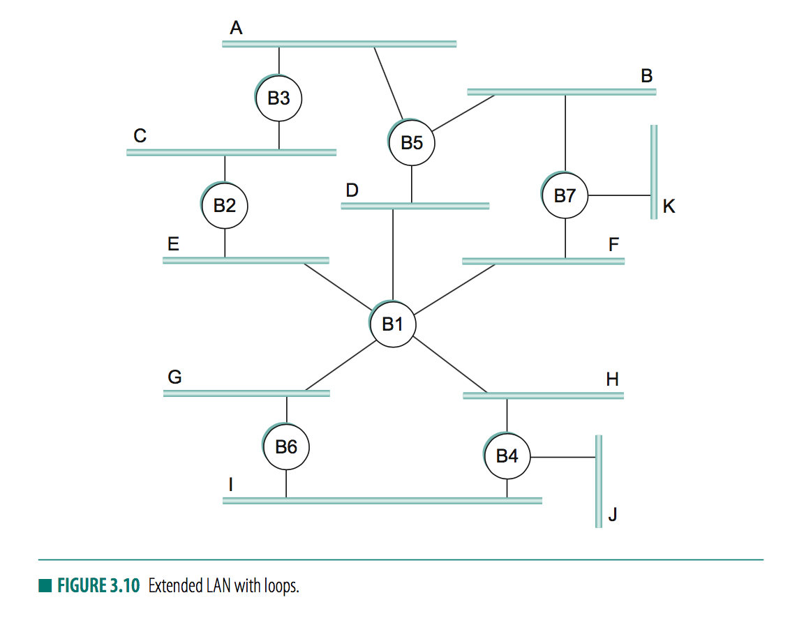
            + _steps_
                + packet enter B4 via J
                + _destination address in any bridge's forwarding table_
                + B4 sends a copy to ethernet H and I
                + B6 forwards packets to ethernet G
                + B1 then forward back to ethernet Hs
                + B4 still doesnt have destination in its table, so forward packet back to ethernet I and J
                + cycle goes on
    + _distributed MST algorithm_ 
        + 
        + _goal_ 
            + create a subset of links that has no loops that reaches all LANs in the extended LAN
            + should be dynamic should some bridge fail
        + _idea_    
            + each bridge decides the ports over which it is nad not willing to forward frames
            + select bridge with smallest ID as _root_ of the spanning tree
            + other bridge 
                + computes shortest path to the root
                + note which of its port is on this path
            + all bridges elect a single _designated bridge_ that will be responsible for forwarding frames towrad the root bridge
        + _message as means of deriving MST_        
            + _message_
                + ID for bridge that is sending message
                + ID for what sending bridges believes to be the root bridge 
                + _distance_ in hops from sending bridge to root bridge
            + each bridge records best configuration message it has seen on each of its port
        + _Initially_ 
            + each bridge think it is the root
            + each bridge broadcast message, also accept incoming messages and see if new message is better than the _current best configuration message recorded for that port_
            + a configuration message is _better than_ currently recorded info if _any_
                + it identifies a root with a smaller ID
                + it identifies a root with equal ID but with smaller distance
                + root ID and distance are equal, but sending bridge has a smaller ID
            + if a new message is better, it replaces the previous message stored
                + _note_ it adds 1 to distance-to-root field since bridge is one hop farther from root than bridge that send the message
        + _then_ 
            + _bridge stop generating configration messages_ on its own and only forwards message (+1 distance) when a bridge receives configuration message indicating it is 
                + not a _root bridge_, i.e. a message with smaller ID
                + not a _designated bridge_, i.e. a message from a bridge that is closer to the root or equally far from root but with a smaller ID
        + _in the end_
            + only root bridge is generating configuration messages
            + only designated bridge is forwarding messages
        + 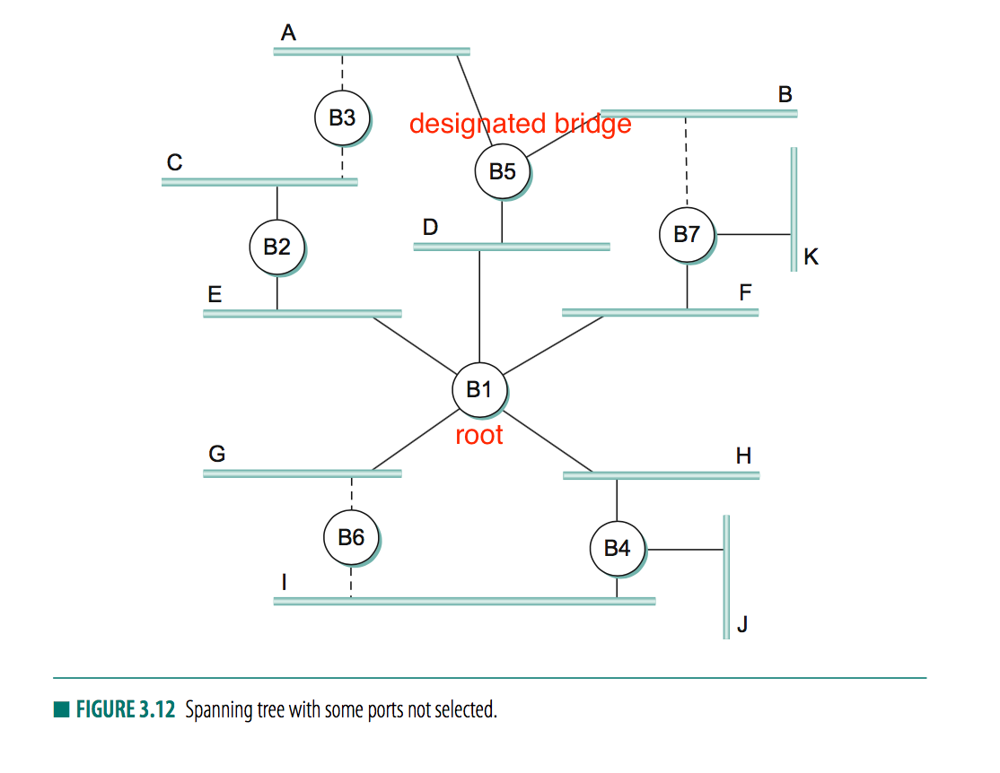
        + 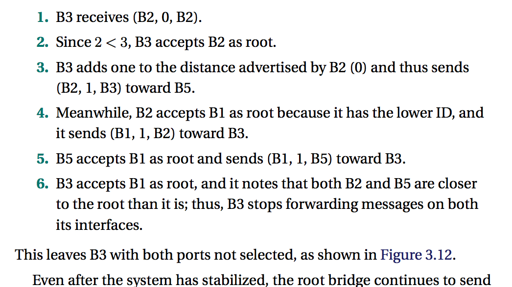
            + `(Y,d,X)` is a message distance `d` from root node `Y` (claims to be) coming from `X`
            + focus on `B3`, in the end both ports of `B3` not selected
    + _limitation of bridges_ 
        + _does not scale_ 
            + not realistic to connect more than a few LANs by means of bridges, since MST algorithm scales linearly
            + broadcast is problematic
        + _solution: Virtual LAN_


#### 3.2 Basic Internetworking (IP)


+ _motivation_ 
    + Needs ways to build _large_ (can scale), and _heterogeneous_ networks with reasonably efficient routing, __internetworks__ 
+ _internetwork (internet)_ 
    + _internet vs Internet_ 
        + _internet_ 
            + arbitrary collection of networks interconnected to provide some sort of host-to-host packet delivery service
        + _Internet_ 
            + the global network we have today 
    + _network, subnetwork, internetwork_ 
        + _network_ 
            + a directed connected, or switched network uses 802.11 or Ethernet
            + i.e. a collection of Ethernets connected by switches/bridges
        + _internetwork_ 
            + interconnected collection of _network_
            + 
            + 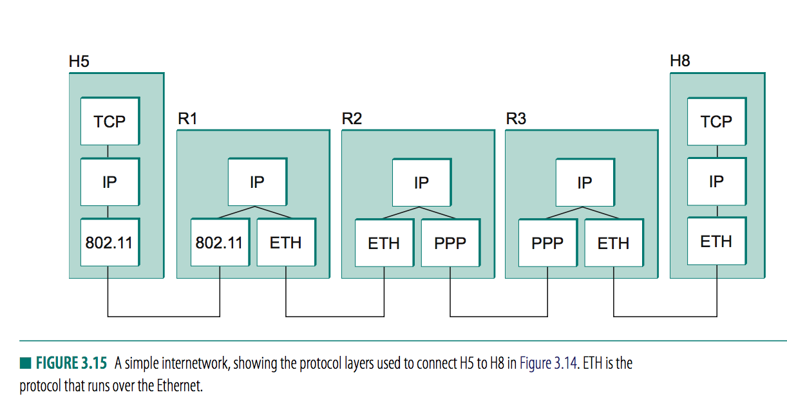
    + _router (gateway)_ 
        + nodes that interconnect networks
    + _Internet Protocol_ (IP)
        + runs on all nodes (host + router) and defines infrastructure that allows nodes and networks to function as a single _logical internetwork_ 
+ _service model_ 
    + _addressing scheme_ 
        + ways to identify all hosts in the internetwork 
    + _datagram (connectionless)_
        + model of data delivery 
        + makes no guarantees
+ _Datagram Delivery_ 
    + _datagram_ 
        + a type of packet that is sent in a connectionless manner over a network 
    + _unreliable service_ 
        + network tries its best to deliver, does not make guarantees
        + hence router can be very simples
    + _Packet format_ 
        + 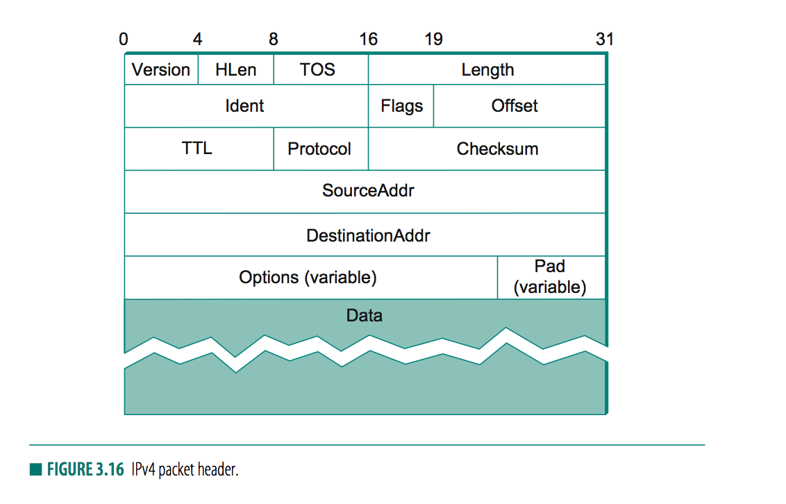
        + _note_ 
            + 32bits chunks, (leftmost byte transmitted first)
            + `Version=4` (IPv4)
            + `HLen` length of header
                + in 32bit words
            + `TOS` type of service
            + `Length` length of datagram (including header)
                + in bytes, so max at `65535` bytes
                + allows fragmentation/assembly
            + `TTL` time to live (hop counter)
                + catch packet inloops and discard them
                + router decrement `TTL` and stop transmitting when it gets to 0
                + defaults to 64
            + `Protocol`
                + demux key for higher level protocols
                + i.e. TCP, UDP
            + `Checksum`, 
                + IP header, ones complement sum of 16bit words, then take ones complement
            + `SourceAddr` 
            + `DestinationAddr`
                + full destination, hence forwarding decision can be made at each router
    + _fragmentation and reassembly_ 
        + _motivation_ 
            + lower level protocols may have differing restriction on data size
        + _Maximum transmission unit (MTU)_ 
            + largest IP datagram that it can carry in a frame for a given link-level protocol
            + Note the _IP datagram_ needs to fit inside the _payload_ of the link-layer _frame_
        + _choice of size_ 
            + usually MTU of the network to which the host is connected
            + Needs fragmentation if path to destination includes a network with a smaller MTU
                + usually on a router that sends a packet with a smaller MTU than size of received datagram
        + _steps_ 
            + router fragments IP datagram
            + update `ident` field to have same identifier
        + _example_ 
            + 
            + each fragment is self-contained IP datagram, independent of each other
            + each IP datagram is re-encapsulated for each physical network over which it travels
            + 
            + header change 
                + `M` bit in `Flags`
                + `Offset` (in 8-byte chunks)
                    + 0: first fragment
                    + 64: after 64*8=512 bytes, 
    + _global addresses_ 
        + _design goal_ 
            + _globally unique_ 
            + _gives hint to network topology_
            + _vs. Ethernet MAC address_ 
                + is unique, but does not give hints to network topology
        + _components_ 
            + _network part_
                + identify network to which host is attached 
                + all hosts in the network share the network part
            + _host part_ 
                + identifies each host uniquely on the network 
        + _router address_
            + a router may have different network address in different ports or interfaces
        + _classes of IP address_   
            + 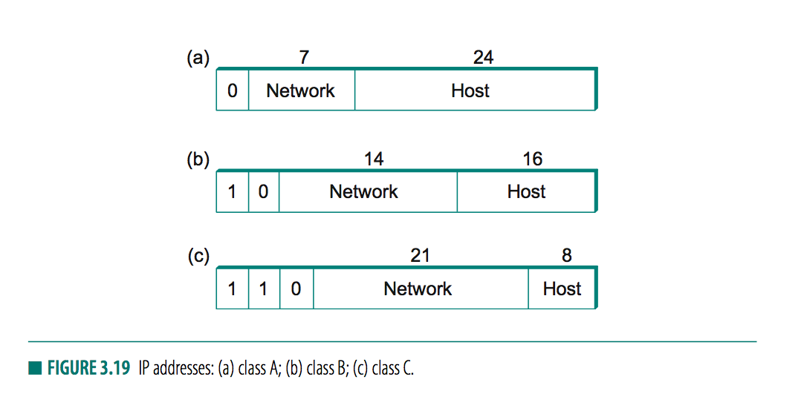
            + 
            class | id | network part | host part
            ---------|----------|---------|--
            A | 0 (0-127)| 2^7-2| 2^24-2
            B | 10 (128-191) | 2^14| 2^16
            C | 110 (192-223) | 2^21 | 2^8-2=254
            + _note_
                + C host part, 255 reserved for broadcast, 0 is not valid host number
        + _writing IP address_ 
    + _Datagram forwrading in IP_
        + _definitions_ 
            + _forwarding_ 
                + process of taking a packet from input and sending it to appropriate output 
            + _routing_ 
                + process of building up tables that allow correct output for a packet to be determined
        + _datagram forwarding algorithm_
            + 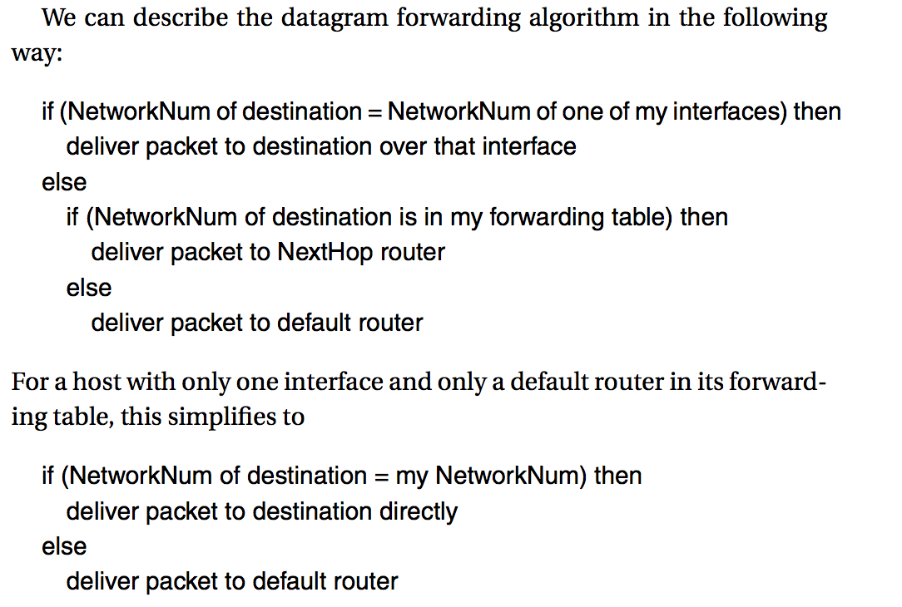  
            + packet arrives
            + A node tries to establish if it is connected to the same physical destination (by comparing network part of `destAddress` with network part of the address of each _network interfaces_)
                + _match_ 
                    + packet send directly over 
                + _no match_ 
                    + node needs to send datagram to a _router_ (the _next hop_ router)
                    + by looking up forwarding table with entry of form `<NetworkNum, NextHop>`
        + _ARP table_ 
            + the fowarding table that finds MAC address of node to which the packet is to be send next
        + _benefit from hierarchical addressing_ 
            + routers now only contain forwarding table that list only a set of network numbers rather than all nodes in the network
    + _Subnetting and classles addressing_ 
        + _address assignment inefficiency_ 
            + say a network with 2 nodes use an entire C network address, therby wasting 253 perfectly useful addresses
            + class B network was slightly more 255 hosts wastes 64000 addresses
            + also larger number of network address, the larger the forwarding table
        + _subnetting_
            + 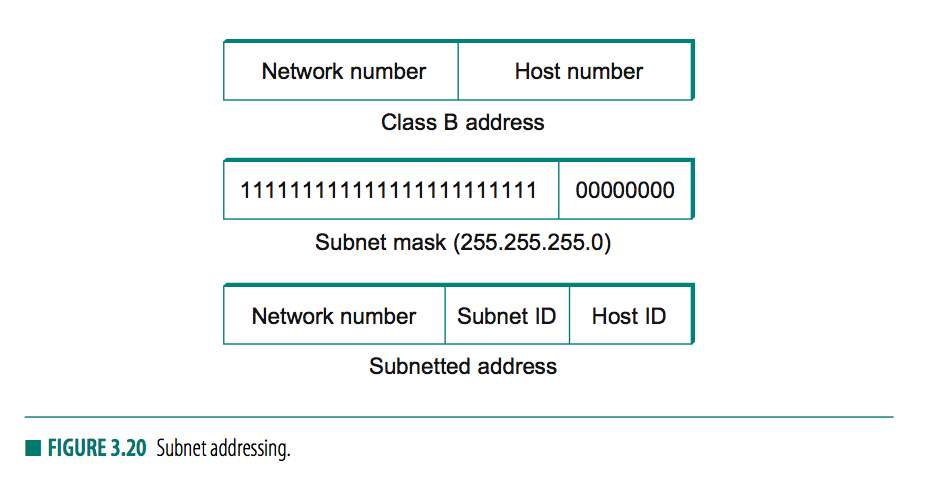
            + _idea_ 
                + take a single IP network number and allocate IP addresses with that network number to several physical networks,_subnet_
                + _subnet_ should be close to each other physically, 
                    + hosts in _subnet_ appear to have 1 IP address from other hosts distant 
                    + so better be in smae gneeral direction 
            + _subnet mask_ 
                + all nodes in each subnet shares a single subnet mask
            + _subnet number_ 
                + a unique number shared by all hosts within the same physical network
                + bitwise AND or subnet mask and IP address of a host 
                + i.e. `128.96.34.15 & 128.96.34.128` equals `128.96.34.0`
            + _IP routing_ 
                + host does `&` between its own subnet mask and destination IP address
                + if equals subnet number of sending host, then destination in the same subnet
                + if results not equal, packet need to be sent to a router to be forwarded to another subnet
            + 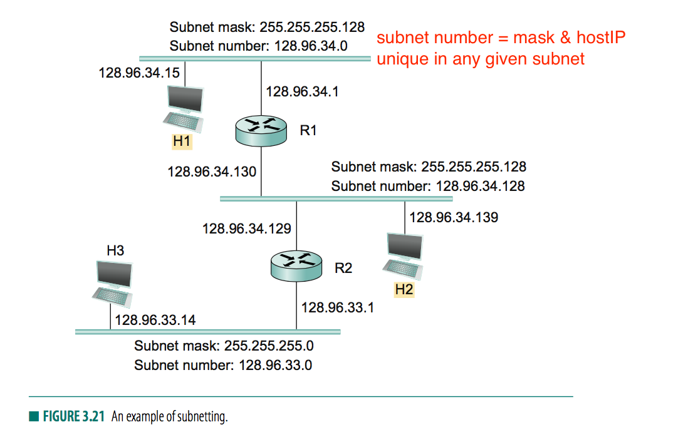
            + 
                + forwarding table for `R1`
            + _forwarding table entry_ 
                + `<SubnetNumber, SubnetMask, NextHop>`
                + to find the right entry in table, 
                    + AND packet destination address with `SubnetMask` in turn
                    + if result match `SubnetNumber` then this is the right entry to use, so packet forwarded as indicated by `NextHop`
            + _forwarding algorithm_    
                + 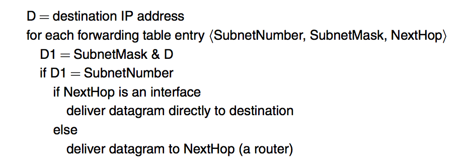
        + _classless addressing_ 
            + _definition_ 
                + _classless interdomain routing (CIDR)_ (supersetting)
                + gives capability of coalesce several classful address among multiple subnets into a single supernet
            + _idea_  
                + might want to give organization network addresses 256 addresses at a time to minimize waste but still be enough
                    + but different, say 16 class C, network addresses will mandate 16 entries in forwarding table, even though they might all be going to the same destination
                + want to minimize number of entries in routers by using a _single entry_ in forwarding table by _aggregating routes_ 
                    + i.e. given network addresses `192.4.16-31`, 
                    + top 20bits same 
                    + so we made a 20-bit network number `194.4.16/20`
                + but have to hand out C class addresses with _common prefixes_ 
                    + i.e. each block contain a number of C class networks that is a power of 2
            + _notation_ 
                + prefix can be any length 
                + put `/X` after prefix, where `X` is prefix length in bits
                + examples
                    + `192.4.16` to `192.4.31` -> `194.4.16/20`
                    + `19.4.16` as a single network address -> `194.4.16/24` 
            + _scalability with ISP_
                + 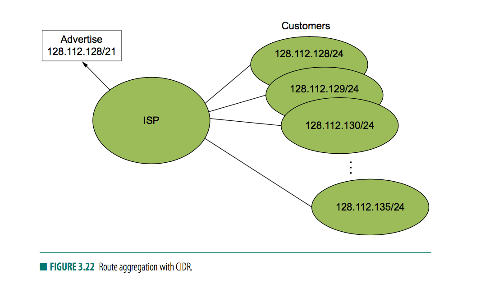
                + _note_ 
                    + customers share 21-bit prefix 
                    + network share a common, shorter address prefix, then we can get even greater aggregation of routes
        + _IP forwarding revisit_ 
            + _problem_ 
                + might have prefixes in a single forwarding table that overlaps
                    + i.e. `171.69` (16-bit prefix) and `171.69.10` (24-bit prefix)
                + match packet against longest prefix 
                    + i.e. `171.69.10.5` match `171.69.10` 
                    + i.e. ``171.69.5` match `171.69`
    + _Address Translation(ARP)_
        + ARP
            + address resolution protocol
        + _goal_ 
            + a mapping from IP addresses to link-level physical addresses
         +_steps_ 
            + if a host want to send an IP to a host in the same network, first checks for mapping in ARP 
            + if no mapping found, invoke ARP, by broadcasting an ARP query over network, containing IP address in question
            + each host receives query and see if it matches the IP address, if does match, host send a response message containing _link-level address_ back to originator of the query
            + originator updates ARP table 
        + _ARP packet_ (28bytes)
            + 
                + `HardwareType` i.e. Ethernet
                + `ProtocolType` i.e. IP
                + `HLen/PLen` hardware/protocol address length
            + also include IP address and link-level address of sending host
            + so broadcasting a query message also allows hosts in network to learn sender's link-level address and IP address
                + some refresh entry, resets time until discard the entry
                + if a host is not target and does not already have an entry for the source in ARP, then it does not add the entry to the source
    + _Host Configuration (DHCP)_ 
        + _motivation_  
            + IP address is _globally unique_ and should reflect structure of internetwork 
            + so not possible for IP address to be configured into a host by manufacturer (like MAC addr) since it would mean a host once connected to a network could never move to another
            + also manual configuration is error-prone
        + _dynamic host configuration protocol (DHCP)_ 
            + _goal_    
                + automatic configuration of host IP
            + _DHCP server_ 
                + one server for an administrative domain
                + central repo for host configuration info 
                + config info retrieved by each host when booted/connected to network 
                + might maintain a pool of addresses to hand out to hosts on demand
            + _server discovery_
                + 
                + host send `DHCPDISCOVER` message to IP `255.255.255.255` (IP broadcast)
                + _relay agent_ configured with IP of DHCP server, upon receiving `DHCPDISCOVER`, relays the message with unicast to the server and waits/forward response back 
            +_DHCP packet_
                + 
                + `chaddr` contains host physical address (ethernet)
                + `yiaddr` filled by server with IP address
    + _Error reporting (ICMP)_ 
        + _motivation_ 
            + at IP level, what happens when 
                + router does not know where to forward
                + a fragment of datagram fails to arrive at destination 
        + _Internet control message protocol (ICMP)_
            + defines error messages to be sent back to source host whenever a router or host is unable to process an IP datagram
                + i.e. host unreachable, reassembly failed, TTL reached 0
            + _control messages_ 
                + _ICMP redirect_ 
                    + tells source host there is a better route to destination
                + _use case_ 
                    + a host with 2 routers, 
                    + if 1 router know the other has a better idea of destination, it instructs host to sen future datagrams to the other router
            + _underlies_
                + `ping` 
                    + determine if a node is reachable and alive
                + `traceroute`
                    + determien set of routers along path to destination
    + _Virtual network and tunnels_ 

#### 3.3 Routing


+ _motivation_ 
    + switches/routers consult _forwarding table_
    + 
    + _forwarding table_ 
        + used when a packet being forwarded must contain enough info to accomplish the forwarding 
            + a row in table _maps network prefix to outgoing interface and some MAC info_
            + exactly how to forward
        + require fast look up
    + _routing table_ 
        + a table built up by routing algorithms as precursor to building forwarding table
            + contains _mapping from network prefixes to next hops_
        + require ease of calculating change in topology
    + _intradomain routing protocol_/_interior gateway protocols_ (IGPs)
        + routing in small to midsized networks 
    + _domain_ 
        + internetwork in which all routeres are under the same administrative control (ISP, or a university)
+ _Network as a graph_ 
    + 
    + _distributed dynamic algorithms_ 
        + _dynamic_ 
            + have to adjust to changing edge cost, node failures
+ _Routing protocols_ 
    + _Distance-Vector (RIP)_
        + _idea_ 
            + each node has a 1D array containing _cost to all other nodes_ 
            + then distribute this vector to immediate neighbors
        + 
            + _note_ 
                + unknown cost assigned infinity
                + neighbors sets cost of 1, and infinity to all other nodes
            + _each vector(row)_ 
                + represent current beliefs of that node
        + _steps_ 
            + 
            + 
            + 
            + idea is that every node sends message to directly connected neighbors containing its distance vector
            + the sent host updates its cost, if going through the node leads to a lower cost
        + _convergence_     
            + process of getting consistent routing information for all nodes
        + _when to update_ 
            + _periodic update_ 
                + each node sent update message once in a while
            + _triggered update_ 
                + when a link notice a link failure or receives update from its neighbors, causing it to change routes in the table
                + _failure dectection_ by sending control signal while expecting awk
        + _counting to infinity problem_ 
            + cases where network distance vector does not stablize 
            + i.e.  
                + `A-E` link failed 
                + Initially, `A` advertise `A-E` has distance of infinity, `B` `C` `F` advertise it has distance of 2 to `E`
                + by chance, `B` knows `C-E` has cost of 2, and `B` and `C` are neighbors, so `B` thinks `B-E` is 3
                + `A` is neighbor of `B` so thinks `A-E` is 4
                + `C` is neighbor of `A` so thinks `C-E` is 5
                + this looks over to infinity
            + _solution_ 
                + _set a relatively small number as approximation of infinity_ 
                    + i.e. 16, the loop goes to 16 faster 
                + _split horizon_ 
                    + idea is when a node sends a routing update to neighbors, it does not send these routes learnt from each neighbor back to that neighbor
                    + i.e. 
                        + `B` has route `<E,2,A>`
                        + then `B` knows it learnt the route from `A`
                        + so whenever `B` sends update to `A`, `<E,2,...>` is omitted
                + _split horizon with poin reverse_ 
                    + `B` actually sends that route back to `A`, but it puts negative information on the route to ensure `A` will not eventually use `B` to get to `E`
                    + i.e. 
                        + `B` sends `<E,infinity>` to `A`, 
                + _problems with split horizon_ 
                    + only works for routing loops involving two nodes
                + _proposed solution_ 
                    + let `B` and `C` wait for a bit, so that they hear about link failure from `A` before advertising route update to `E` to other hosts
    + _Routing Information Protocol (RIP)_ 
        + _idea_ 
            + build on top of distance-vector algorithm 
            + but differs in router advertise cost of reaching networks
                + i.e. if router `A` lerans from router `B` that network `X` can be reached at a lower cost via `B` than via existing next hop, then updates cost and next hop to `B`
        + _implementation_ 
            + _packet_ 
                + `<address, mask, distance>`
                + 
            + router sends advertisement every 30s
            + link cost is 1, so tries to find minimual hops
            + 16 represent infinity
    + _Link state (OSPF)_
        + _idea_    
            + make sure entirety of network (not just neighbors) is known to every node
            + relies on
                + reliable disseminiation of link-state info 
                + calculation of routes from sum of all accumulated link-state knowledge
        + _reliable flooding_ 
            + _goal_ 
                + make sure all nodes participating in routing protocol get s acopy of link-state info 
            + _idea_ 
                + send link-state info out to all of its directly connected links, and hosts forwards such message on all of their links
            + _link state packet (LSP)_
                + ID of node created the LSP 
                + list of directly connected neighbors of that node, cost of link to each 
                + sequence number   
                    + ensure newer info replaces older info
                + TTL
                    + ensure old link state info is eventually removed
                    + always decrement TTL before being flooded out or being stored in node, 
                    + if TTL goes to 0, send LSP with TTL of 1, interpreted as signal to delete LSP
            + _reliability_ 
                + awk and retransmission 
            + 
                + `X` receive LSP from `Y`
                + `X` checks if it already has copy of LSP form `Y` or not
                + if so, compare sequence number, update table if LSP has a larger sequence number (newer)
                + in this case, `X` sends a copy of LSP to all its neighbors except the incoming interface
        + _route calculation_ 
            + _dijkstras shortest path algorithm_
                + 
                + add link that is currently reachable at lowest cost and add to the set of shortest paths starting from a node `s`
            + 
            + 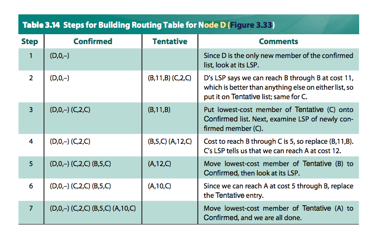
        + _advantage_ 
            + stablize quicly
            + does not generate much traffic
            + responds well to node fialures
        + _disadvantage_ 
            + lots of info stored in each node
    +  _open shortest path first protocol (OSPF)_
        + _addition to link state_ 
            + authentication or routing message
                + prevent one bad node ruin entire network
            + additional hierarchy
                + more scalable
            + load balancing


                


