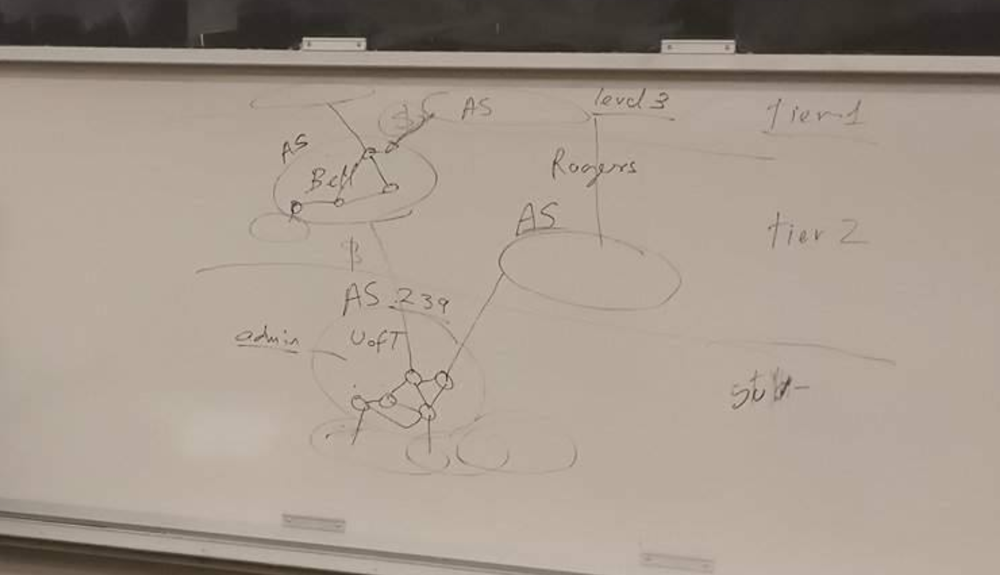
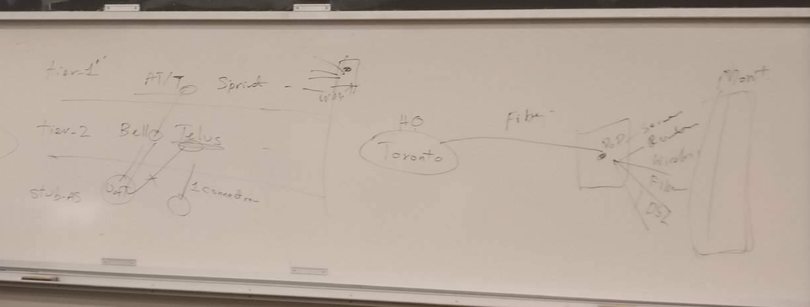
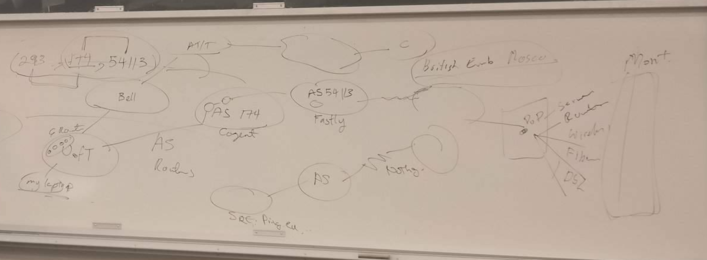
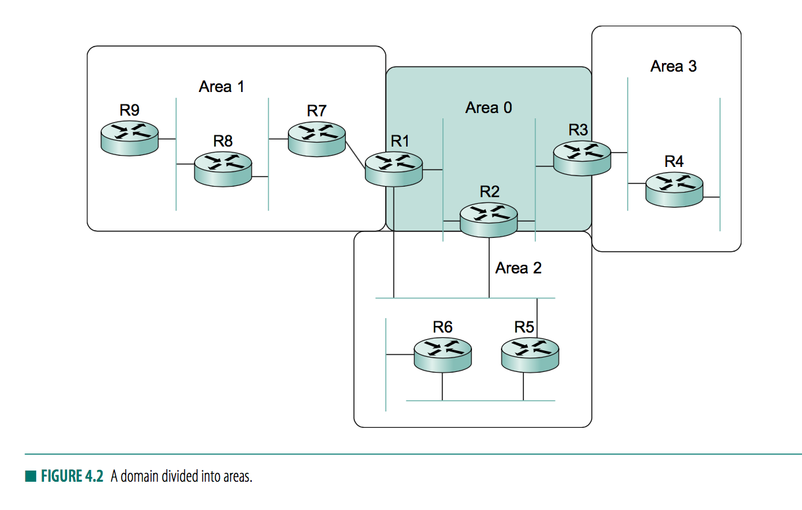
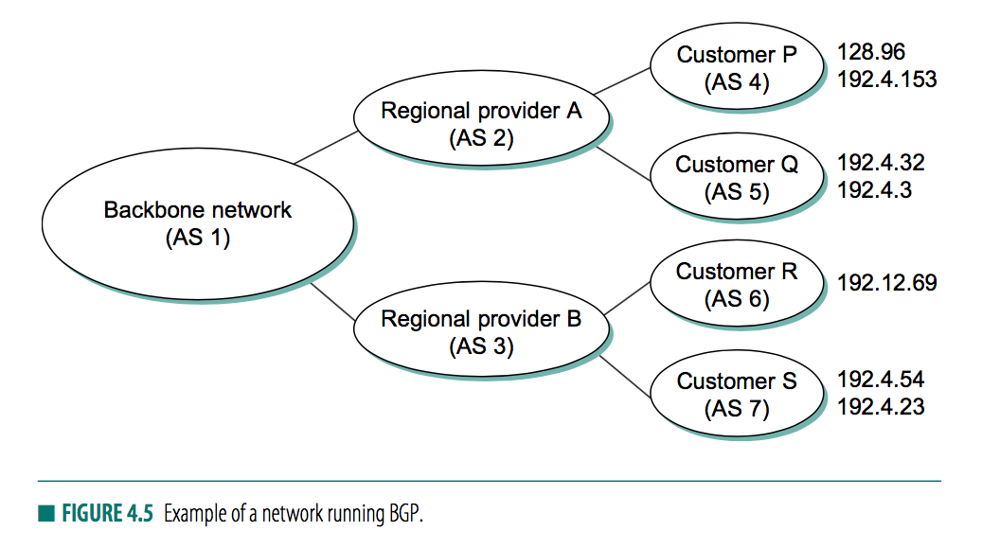
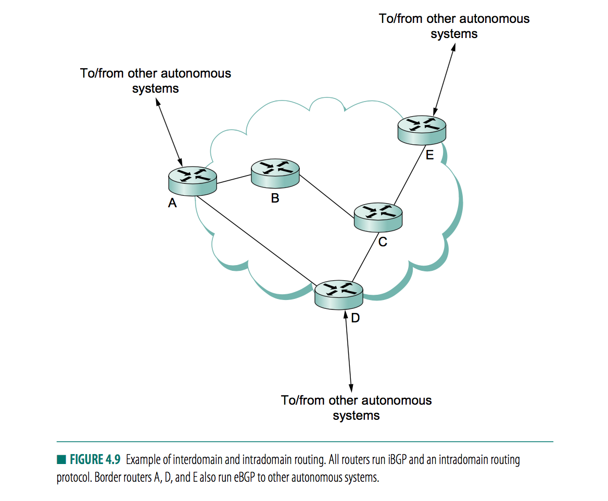
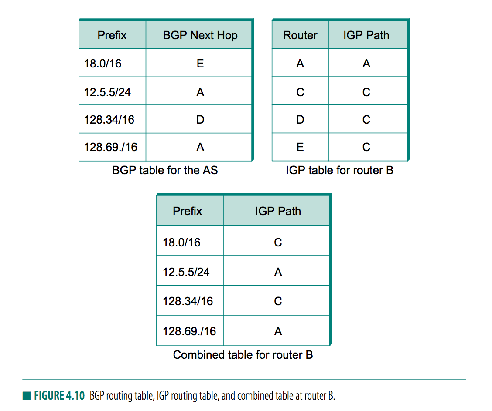
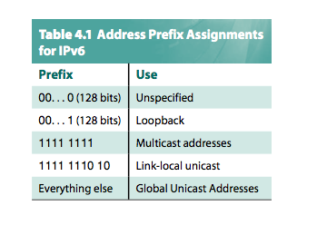

--- 

##### Q5

```
// f=infinity
steps       set         R2  R3  R4  R5  R6  R7  R8
1           R1          f   f   f   f  1,R1 f   2,R1
2          R1,R6        f   4,R3 f  5,R6 1  f   2,R1
3       R1,R6,R8        f   4,R6 f  5,R6 1  7,R6  2
4       R1,R6,R8,R3     f   4   f   5,R6 1  7,R6  2
5   R1,R6,R8,R3,R5      8,R5 4  10,R5 5  1  7,R6  2
6 R1,R6,R8,R3,R5,R7     8,R5 4  9,R7  5  1  7     2
7 R1,R6,R8,R3,R5,R7,R2  8   4   9,R7  5  1  7     2
```
```
routing table (R1)
dest    next hop
R2      R6
R3      R6
R4      R8
R5      R6
R6      R6
R7      R8
R8      R8
```


##### Q7 Fragmentation 

TCP: size 3000 send over 3 IP routers (MTU 1500bytes, 800bytes, 1000bytes)
Note 
    + Router does fragmentation, router works at IP layer
    + MTU represent IP packet size

```
       [  20bytes IP header ][       3000bytes TCP message         ]
-------
30bytes data link not needed, since router does fragmentation
```
```
A ---------> R1  ------>  R2  -------> R3
    1500         800           1000       size of packet can carry 
    1480         780           980        size of data (exclude 20bytes IP header)
```
```
// over first router , the 3000bytes message fragmented into 3 IP packet
[   3000    ]
[  1480  ][  1480  ][  40  ]        fragment length 

                                    packet size     offset in IP header
[ 20B IP header][ 1480 ]            1500            0
[ 20B IP header][ 1480 ]            1500            1480/8=185 (offset in group of 8 bytes)
[ 20B IP header][ 40 ]              60              2960/8=370 
```
```
// over second router, have to fragment 1500 bytes packet again 
[   1480    ]
[   776     ][   704    ]           fragment length 

                                    packet size     offset in IP header
[ 20B IP header][ 776 ]             796            0
[ 20B IP header][ 704 ]             724            776/8=97  (offset cant be decimal, round down, and find l)

// the second 1500 bytes packet has offset of 185+0 and 185+97
// the third one does not get fragmented
```


##### 3 longest prefix match lookup 


routing table prefixes with 
    + `31.75/16` (for packet to port 1) and 
    + `31.75.93.128/25` (packet to port 2)
another packet with IP `31.75.93.129` will be send to which port?


--- notes 


+ _autonomous system_
    + Within the Internet, an autonomous system (AS) is a collection of connected Internet Protocol (IP) routing prefixes under the control of one or more network operators on behalf of a single administrative entity or domain that presents a common, clearly defined routing policy to the Internet.
    + _AS number_ 
        + A unique ASN is allocated to each AS for use in BGP routing. AS numbers are important because the ASN uniquely identifies each network on the Internet.
+ _BGP_ 
    + standard exterior gateway protocol for exchanging routing and reachability information between AS 
    + _application_
        + multiple organizations can run Border Gateway Protocol (BGP) using private AS numbers to an ISP that connects all those organizations to the Internet
+ _Interior gateway protocol_ 
    + for exchanging routing information between routers within a AS
    + _RIP_ 
    + _OSPF_


--- 


# 4 Advanced Internetworking 


#### 4.1 The global Internet

+ _autonomous system (AS)_ 
    + a network administered independently of other ASs
    + _scalability_ 
        + minimize number of network numbers to be stored in routing table 
        + _address utilization_
    + _solution_ 
        + _CIDR_ and _subnetting_ 
        + _hierarchy_ 
+ _Routing area_ 
    + 
    + _area_ 
        + a set of routers administratively configured to exchange link-state information with each other
    + _backbone area (area 0)_ 
    + _area border router (ABR)_ 
        + router that is both a backbone area and nonbackbone area
    + _routing_ 
        + router within a single area send link-state advertisements to each other, 
        + flooding and route-calulation does not extend beyond _area border routers_ 
            + i.e. R4 in area 3 never see link-state advertisement from R8 in area 1
        + routing cross areas depends on packet going through a backbone network 
        + _area border router_ summarize routing information learned from one area and make it available in their advertisement to other areas
            + i.e. R1 receives link-state advertisement from all routers in area 1, so able to determine cost to any router in area 1, 
            + then R1 sends link-state advertisement to area 0, as if all those networks in area 1 are connected directly to R1
+ _Interdomain Routing (BGP)_ 
    + _autonomous system_
        + provide additional way to hierarchincally aggregate routing information in a large internet
        + _types_ 
            + _stub AS_
                + AS tha thas only a single connection to one other AS, carry small traffic 
            + _Multihomed AS_
                + AS with connection to more than 1 AS but refuses to carry transit traffic, large corporation
            + _Transit AS_
                + connection to more than 1 other AS, designed to carry both transit and local traffic, i.e. backbone providers
    + _routing_ 
        + intradomain and interdomain routings are decoupled 
        + _goal_ 
            + finding a non-looping, policy compliant path
    + _intradomain routing_ 
    + _interdomain routing_ 
        + _challenges_ 
            + each AS has its own routing policies
            + privacy 
+ _BGP basics_ 
    + _gateway_ 
        + border routers that forward packets between autonomous systems 
    + _path-vector protocol_ 
        + advertises _complete path_ as an numerated list of AS to reach a particular network
        + gives only _reachability_ information
    + 
        + `AS2` advertises `128.96`, ... is reachable from `<AS2>`
        + `AS1` advertises `128.96`,... is reachable from `<AS1, AS2>`
        + carrying complete path prevents looping, if `AS1` sees itself in a AS-path, then the path is dropped
    + _packet format_
        + 
    + _advertisement_ 
        + AS will pick the best routes and (may or may not) advertise that one
    + _withdraw route_ 
        + advertise not reachability information
    + _keepalive_ 
        + on TCP, send keepalive message once in a while
        + if routes no longer valid, then other routers learns about it quickly
+ _Common AS relationships and policies_ 
    + _provider-consumer_ 
        + advertise all routes known to customer
        + advertise routes learnt from customer to everyone 
    + _customer-provider_
        + advertise customer's own IP prefixes and routes learnt from customers to provider
        + advertises routes learnt from provider to customers
        + do not advertise routes learnt from one provider to another provider
            + to prevent customer from carrying traffic 
    + _peer_ 
        + 2 provider get access to each other's customers without having to pay another provider 
        + advertise routes learnt from my customers to my peer, 
        + advertise routes from my peer to my customers,
        + but dont advertise routes from my peers to any provider and vice versa
            + prevent transit through providers 
+ _Integrating Interdomain and Intradomain routing_ 
    + _border router_ 
        + inject _default route_ into intradomain routing protocol 
            + saying that any netwrok not explicitly advertised in intradomain protocol is reachable throug border router
        + inject _specific routes_ learnt from outside AS 
            + makes other routes in AS to learn that border router is the place to send packets destined for that prefix
            + but hard to scale for backbone ASs, use iBGP
    + _interior BGP (iBGP)_ 
        + redistribute information learnt by BGP speakers at edges of AS to all other routers in the ASs
        + enables any router in AS to learn best border router to use when sending a packet to any address
        + each router in AS keeps track of how to get to each router using a conventional intradomain protocol with no injected information
    + _exterior BGP (eBGP)_ 
        + runs between ASs
    + 
    + 
        + `A` `D` `E` speaks eBGP ot other AS and learn how to reach various prefixes
        + `A` `B` `C` `D` `E` builds a mesh of iBGP sessions 
        + `B`
            + with iBGP, learns that some external prefixes are best reached via router the border routers `A` `D` `E` 
            + with interior gateway protocol (IGP = RIP, OSPF), `B` learns how to reach other nodes inside AS (specifically to `A` `D` `E`)
            + combines these two tables
        + so any router in AS can build up a complete routing table for any prefix that is reachable via some border router of the AS


#### 4.13 IPv6


+ _IPv6_ 
    + _addressing_  
        + 128bits
    + _address space allocation_
        + classless like CIDR
        + 
            + _unspecified_ 
                + for class A B C of IPv4
            + _multicast_
                + same as class D in IPv4
    + _address notation_ 
        + x:x:x ... each x for 16bits=4hex
    + _global unicast addresses_ 
        + 
+ _NAT_ (network address translation)
    + _idea_ 
        + all hosts that might communicate with each other over the internet do not need to have globally unique addresses
        + a host can be assigned private address within some scope
        + _communication within_ OK 
        + _communication to the outside_ 
            + handled via a NAT box, a device that translate from private addressed used by host to some globally unique address that is assigned to the NAT box
            + NAT box keeps track of a small pool of globally unique addresses
    + _mechanism_   
        + IP packet received from a host inside corporation, 
            + translate IP source addr from some private address (`10.0.1.5`) to a globally unique address (`171.69.210.246`)
            + when packets comie back from the sent remote host, the NAT box translates destination IP address (`171.69.210.246`) back to local (`10.0.1.5`)
    + _key drawback_ 
        + breaks assumption that IP model - all nodes have globally unique addresses
            + FTP carries IP addresses in messages, which also needs to be translated by a NAT box
        + make it difficult for outside device to initiate a connection to a device on the private side of NAT
            + since no public address to which to send the connection request
    + _advantages_ 
        + easier to switch service providers, since local IPs has no relation to provider's address space 
        + addresses behind NAT are not globally meaningful help with protection against simple attacks


### 4.2 Multicast 


+ _motivation_ 
    + ethernet has multicast in hardware
    + one-to-many applications needs multicasting capabilities
        + currently requires sending identical packets to each remote target
