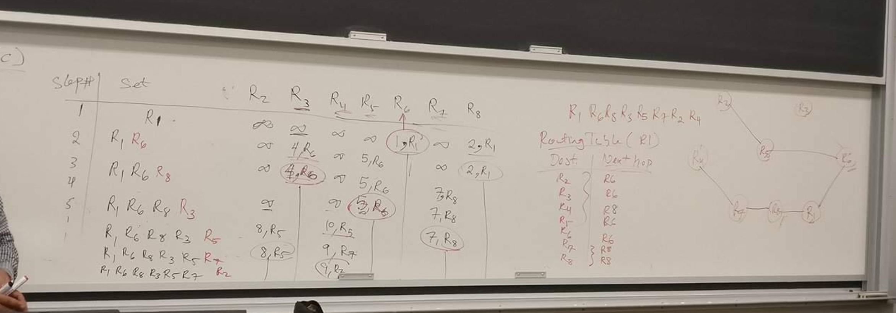

--- 

##### Q5

```
// f=infinity
steps       set         R2  R3  R4  R5  R6  R7  R8
1           R1          f   f   f   f  1,R1 f   2,R1
2          R1,R6        f   4,R3 f  5,R6 1  f   2,R1
3       R1,R6,R8        f   4,R6 f  5,R6 1  7,R6  2
4       R1,R6,R8,R3     f   4   f   5,R6 1  7,R6  2
5   R1,R6,R8,R3,R5      8,R5 4  10,R5 5  1  7,R6  2
6 R1,R6,R8,R3,R5,R7     8,R5 4  9,R7  5  1  7     2
7 R1,R6,R8,R3,R5,R7,R2  8   4   9,R7  5  1  7     2
```
```
routing table (R1)
dest    next hop
R2      R6
R3      R6
R4      R8
R5      R6
R6      R6
R7      R8
R8      R8
```




##### Q7 Fragmentation 

TCP: size 3000 send over 3 IP routers (MTU 1500bytes, 800bytes, 1000bytes)
Note 
    + Router does fragmentation, router works at IP layer
    + MTU represent IP packet size

```
       [  20bytes IP header ][       3000bytes TCP message         ]
-------
30bytes data link not needed, since router does fragmentation
```
```
A ---------> R1  ------>  R2  -------> R3
    1500         800           1000       size of packet can carry 
    1480         780           980        size of data (exclude 20bytes IP header)
```
```
// over first router , the 3000bytes message fragmented into 3 IP packet
[   3000    ]
[  1480  ][  1480  ][  40  ]        fragment length 

                                    packet size     offset in IP header
[ 20B IP header][ 1480 ]            1500            0
[ 20B IP header][ 1480 ]            1500            1480/8=185 (offset in group of 8 bytes)
[ 20B IP header][ 40 ]              60              2960/8=370 
```
```
// over second router, have to fragment 1500 bytes packet again 
[   1480    ]
[   776     ][   704    ]           fragment length 

                                    packet size     offset in IP header
[ 20B IP header][ 776 ]             796            0
[ 20B IP header][ 704 ]             724            776/8=97  (offset cant be decimal, round down, and find l)

// the second 1500 bytes packet has offset of 185+0 and 185+97
// the third one does not get fragmented
```


##### 3 longest prefix match lookup 


routing table prefixes with 
    + `31.75/16` (for packet to port 1) and 
    + `31.75.93.128/25` (packet to port 2)
another packet with IP `31.75.93.129` will be send to which port?


--- notes 


+ _autonomous system_
    + Within the Internet, an autonomous system (AS) is a collection of connected Internet Protocol (IP) routing prefixes under the control of one or more network operators on behalf of a single administrative entity or domain that presents a common, clearly defined routing policy to the Internet.
    + _AS numbr_ 
        + A unique ASN is allocated to each AS for use in BGP routing. AS numbers are important because the ASN uniquely identifies each network on the Internet.
+ _BGP_ 
    + standard exterior gateway protocol for exchanging routing and reachability information between AS 
    + _application_
        + multiple organizations can run Border Gateway Protocol (BGP) using private AS numbers to an ISP that connects all those organizations to the Internet
