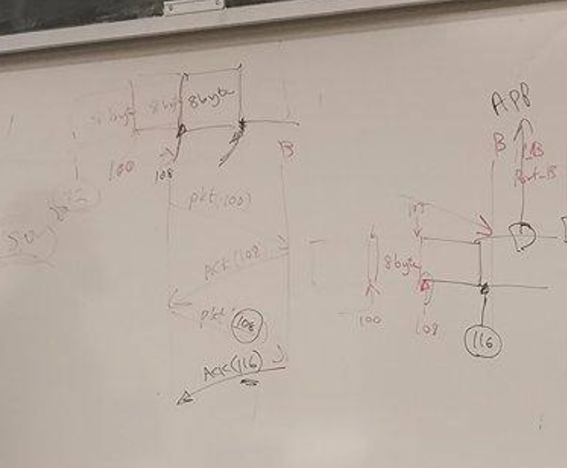

+ sequence number `ISN`
    + used to distinguish one TCP connection to another 
    + 32bit timer that ticks every 4microsecond
    + value of timer copied to ISN



+ Initially get ISN from ISN clock
+ Then for each segment, recompute 
    + `ISN_{i+1} = ISN_{i} + segmentlength`
    + Sequence number inside TCP header, 
+ If 8 bytes segment, 
    + Host A sends `SYC(100)`
    + Host B 
        + placing segment in a buffer
        + send back `AWK(108)` 


```
A ISN 92                    B ISN 20
>>>>>>>>    SYN(92)         >>>>>>>>
<<<<<<<<    SYNAWK(20, 93)  <<<<<<<<
>>>>>>>>    AWK(93, 21)     >>>>>>>>
```


+ RTT estimation 
    + `estimatedRTT = a x oldestimatedRTT + b x CurrentRTT`

```
// sliding window
// A sends a bunch, and wait for awks 
A               B
| >>>>> 1 >>>>>>   |
| >>>>> 2 >>>>>>   |
| >>>>> 3 >>>>>>   |
| <<<<< 1 <<<<<<   |
| <<<<< 2 <<<<<<   |
| <<<<< 3 <<<<<<   |
```

+ if some syc lost 
    + `B` keeps sending `awk(ISN_missing)`
    + `A` will resend the segment


+ 2 sliding window algo 
    + selecive repeat 
        + timer for each packet sent 
        + just repeat sending the packet lost
    + go back n 
        + go back to nth packet that is lost and 
        + retransmit all packet afterwards