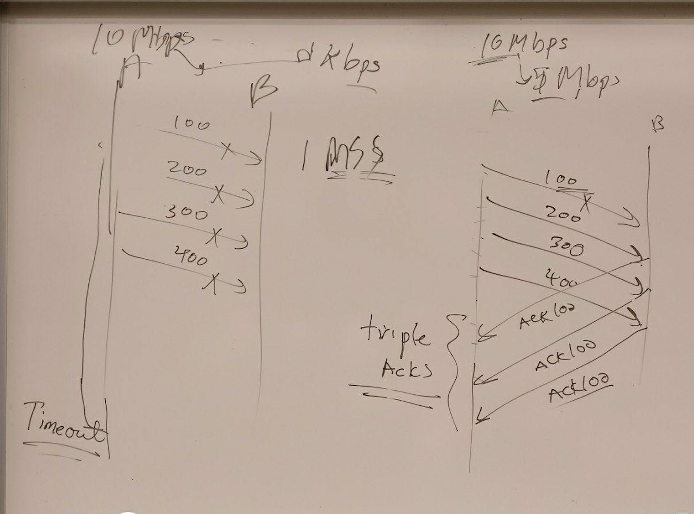
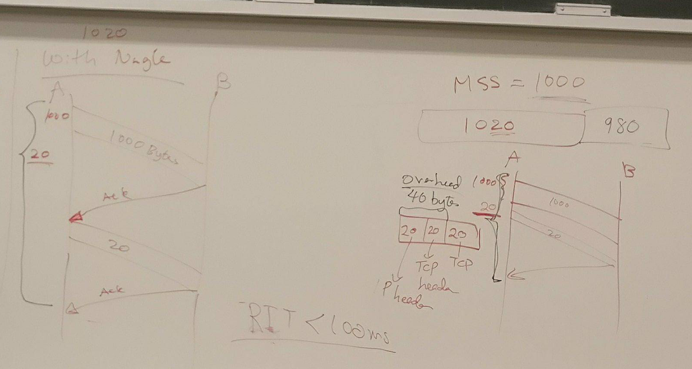

+ fairness
    + gives each packet the maximum it can achieve, then care about fairness
        + `f1` has 3.3Mbps instead of `5Mbps` since its limited by `R3`'s bandwidth 
        + `f2` hence can get `10-3.3=7.7`mbps for `R1`
+ TCP
    + constantly increasing bandwidth until packet drop, 
        + i.e. `f2` increase to 7.7, lost packet, then reduce by half to 3.35
    + this way, bandwidth of a packet not going to exceed the smallest bandwidth of links along the route

+ congection detection
    + triple awk
        + cut by half 
    + timeout 
        + to minimum (1MSS maximum segment size)

+ TCP mechanism

+ fairness index
    + only for a single router
    + (least fair) 0 - 1 (most fair)

+ nagle's algorithm
    + if available data is greater than MSS, 
        + send the payload
    + else 
        + if unconfirm data (not awk data)
            + queue
        + else 
            + send

+ NAT
    + problem   
        + what if client wants to connect to server behind NAT ?
            + NAT router does not have the mappinng yet
            + but server can request port forwarding set up, a port # is reserved in NAT table for the server behind the NAT