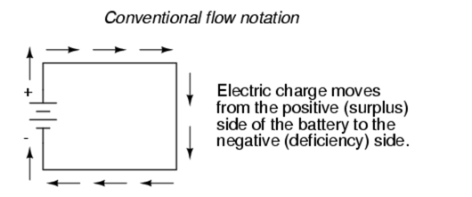
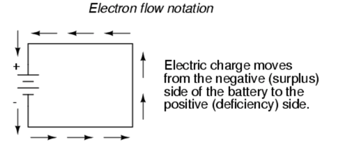

1. Doping gives a semiconductor an overall positive or negative charge
  + false; the silicon + boron/phosphorus are all charge balanced.

2. What kind of bias on a pn junction causes the depletion layer to expand (stop conducting)?
  + reverse bias

3. Phosphorus has 5 electrons in its outer valence shell. When added in small amounts to silicon, the result is a __n__ junction

4. logic gates are from transistors. a nMOS transistor conducts if we apply __5__ volts (__logic 1__) to its gate

5. pMOS conducts if we apply __0__ Volts (__logic 0, Gnd__) at its gate

A B W Y
0 0 1 0
0 1 0 1
1 0 0 1
1 1 0 1

---

Doping

p, n doped semiconductor are relatively conductive on their own. but the junction between them can become depleted of charge carriers, and hence non-conductive, depending on the relative voltages of the two semiconductor regions. By manipulating this non-conductive layer, p–n junctions are commonly used as diodes: circuit elements that allow a flow of electricity in one direction but not in the other (opposite) direction. Bias is the application of a voltage across a p–n junction; forward bias is in the direction of easy current flow, and reverse bias is in the direction of little or no current flow.

---
